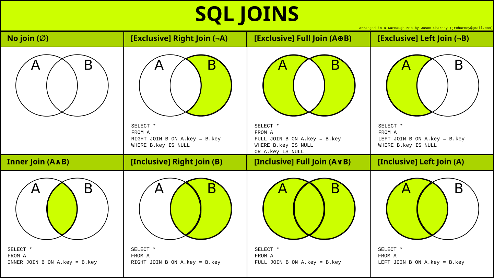
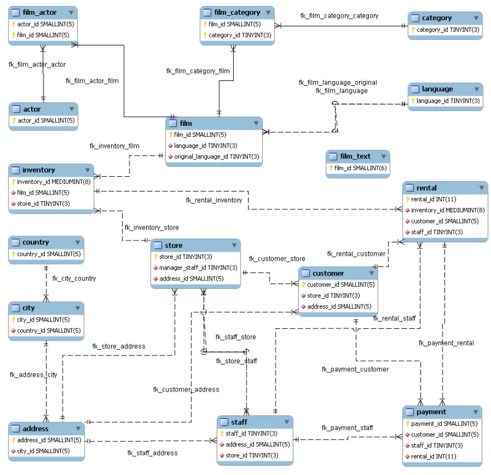
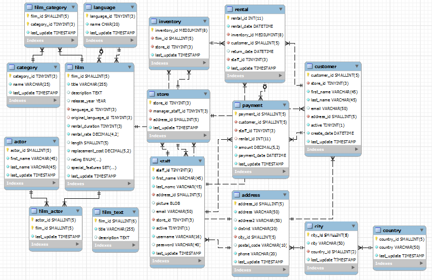
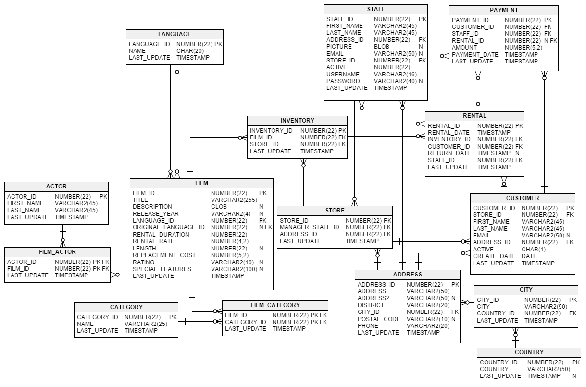

== MySQL `explain` 详解
include::_attributes.adoc[]

进行 MySQL 查询优化，`explain` 是必备技能。这章就来重点介绍一下 `explain`。

=== 示例数据库

为了方便后续讲解，这里使用 MySQL 官方提供的示例数据库： https://dev.mysql.com/doc/sakila/en/[MySQL : Sakila Sample Database^]。需求的小伙伴，请到官方页面下载并安装。

Sakila 库的 Schema 设计图如下：

[[explain-syntax]]
=== `EXPLAIN` 语法

`DESCRIBE` 和 `EXPLAIN` 是同义词。在实践中，`DESCRIBE` 多用于显示表结构，而 `EXPLAIN` 多用于显示 SQL 语句的执行计划。

[{sql_source_attr}]
----
{EXPLAIN | DESCRIBE | DESC}
    tbl_name [col_name | wild]

{EXPLAIN | DESCRIBE | DESC}
    [explain_type]
    {explainable_stmt | FOR CONNECTION connection_id}

explain_type: {
    EXTENDED
  | PARTITIONS
  | FORMAT = format_name
}

format_name: {
    TRADITIONAL
  | JSON
}

explainable_stmt: {
    SELECT statement
  | DELETE statement
  | INSERT statement
  | REPLACE statement
  | UPDATE statement
}
----

这里有一点说明一下，默认情况下，`EXPLAIN` 的结果类似于普通的 `SELECT` 查询语句的表格输出。也可以通过将结果指定为 JSON 格式的，例如：

[{sql_source_attr}]
----
EXPLAIN FORMAT = JSON
SELECT *
FROM actor
WHERE actor_id = 1;
----

=== `DESCRIBE` 获取表结构

`DESCRIBE` 是 `SHOW COLUMNS` 的简写形式。

[{sql_source_attr}]
----
mysql> DESCRIBE actor;
+-------------+-------------------+------+-----+-------------------+-----------------------------------------------+
| Field       | Type              | Null | Key | Default           | Extra                                         |
+-------------+-------------------+------+-----+-------------------+-----------------------------------------------+
| actor_id    | smallint unsigned | NO   | PRI | NULL              | auto_increment                                |
| first_name  | varchar(45)       | NO   |     | NULL              |                                               |
| last_name   | varchar(45)       | NO   | MUL | NULL              |                                               |
| last_update | timestamp         | NO   |     | CURRENT_TIMESTAMP | DEFAULT_GENERATED on update CURRENT_TIMESTAMP |
+-------------+-------------------+------+-----+-------------------+-----------------------------------------------+
----

=== `SHOW PROFILES` 显示执行时间

在 MySQL 数据库中，可以通过配置 `profiling` 参数来启用 SQL 剖析。

[{sql_source_attr}]
----
-- 查看是否开启
SHOW VARIABLES LIKE '%profil%';

-- 开启
SET profiling = ON;
SET profiling_history_size = 100;

-- 查看帮助
HELP PROFILE;

SHOW PROFILES; -- <1>

SHOW PROFILE;

SHOW PROFILE FOR QUERY 119; -- <2>

--查看特定部分的开销，如下为CPU部分的开销
SHOW PROFILE CPU FOR QUERY 119;

--如下为MEMORY部分的开销
SHOW PROFILE MEMORY FOR QUERY 119;

--同时查看不同资源开销
SHOW PROFILE BLOCK IO, CPU FOR QUERY 119;

--显示SWAP的次数。
SHOW PROFILE SWAPS FOR QUERY 119;
----
<1> 建议在 MySQL 命令行工具中使用，否则会混入很多乱七八糟的查询语句。
<2> 在 DataGrip 中还不支持。

结合使用情况来看，这个语句的结果并不稳定，同一条语句多次查询，返回的结果相差很大。

另外，值得一提的是，这个工具在官方文档中已经指出，未来将会被移除，请使用 https://dev.mysql.com/doc/refman/8.0/en/performance-schema-query-profiling.html[Query Profiling Using Performance Schema] 代替。

[[explain-output]]
=== `EXPLAIN` 输出

==== `id`

`SELECT` 标识符，SQL 执行的顺序的标识，SQL 从大到小的执行。如果在语句中没子查询或关联查询，只有唯一的 `SELECT`，每行都将显示 `1`。否则，内层的 `SELECT` 语句一般会顺序编号，对应于其在原始语句中的位置

* `id` 相同时，执行顺序由上至下
* 如果是子查询，`id` 的序号会递增，`id` 值越大优先级越高，越先被执行
* 如果 `id` 相同，则认为是一组，从上往下顺序执行；在所有组中，`id` 值越大，优先级越高，越先执行

==== `select_type`

===== `SIMPLE`
简单 `SELECT`，不使用 `UNION` 或子查询等

===== `PRIMARY`
查询中若包含任何复杂的子部分,最外层的select被标记为PRIMARY

===== `UNION`
UNION中的第二个或后面的SELECT语句

===== `DEPENDENT UNION`
UNION中的第二个或后面的SELECT语句，取决于外面的查询

===== `UNION RESULT`
UNION的结果

===== `SUBQUERY`
子查询中的第一个SELECT

===== `DEPENDENT SUBQUERY`
子查询中的第一个SELECT，取决于外面的查询

===== `DERIVED`
派生表的SELECT, FROM子句的子查询

===== `DEPENDENT DERIVED`
派生表的SELECT, FROM子句的子查询
`MATERIALIZED`::

===== `UNCACHEABLE SUBQUERY`
一个子查询的结果不能被缓存，必须重新评估外链接的第一行

===== `UNCACHEABLE UNION`
？？

==== `table`

访问引用哪个表（例如下面的 `actor`）：

[{sql_source_attr}]
----
EXPLAIN
SELECT *
FROM actor
WHERE actor_id = 1;
----

==== `partitions`

==== `type`

`type` 显示的是数据访问类型，是较为重要的一个指标，结果值从好到坏依次是：
`system` > `const` > `eq_ref` > `ref` > `fulltext` > `ref_or_null` > `index_merge` > `unique_subquery` > `index_subquery` > `range` > `index` > `ALL`。一般来说，得保证查询至少达到 `range` 级别，最好能达到 `ref`。

===== `system` 
当 MySQL 对查询某部分进行优化，并转换为一个常量时，使用这些类型访问。如将主键置于 `WHERE` 列表中，MySQL 就能将该查询转换为一个常量。`system` 是 `const` 类型的特例，当查询的表只有一行的情况下，使用 `system`。

===== `const`

在查询开始时读取，该表最多有一个匹配行。因为只有一行，所以这一行中的列的值可以被其他优化器视为常量。`const` 表非常快，因为它们只读取一次。

[{sql_source_attr}]
----
EXPLAIN
SELECT *
FROM actor
WHERE actor_id = 1;
----

===== `eq_ref`
 
类似 `ref`，区别就在使用的索引是唯一索引，对于每个索引键值，表中只有一条记录匹配，简单来说，就是多表连接中使用 `PRIMARY KEY` 或者 `UNIQUE KEY` 作为关联条件

最多只返回一条符合条件的记录。使用唯一性索引或主键查找时会发生（高效）。

===== `ref`

表示上述表的连接匹配条件，即哪些列或常量被用于查找索引列上的值

一种索引访问，它返回所有匹配某个单个值的行。此类索引访问只有当使用非唯一性索引或唯一性索引非唯一性前缀时才会发生。这个类型跟 `eq_ref` 不同的是，它用在关联操作只使用了索引的最左前缀，或者索引不是 `UNIQUE` 和 `PRIMARY KEY`。`ref` 可以用于使用 `=` 或 `<=>` 操作符的带索引的列。

[{sql_source_attr}]
----
EXPLAIN
SELECT *
FROM address
WHERE city_id = 119;
----

===== `fulltext`

全文检索

[{sql_source_attr}]
----
EXPLAIN
SELECT *
FROM film_text
WHERE MATCH(title, description) AGAINST('ACE')
LIMIT 100;
----

===== `ref_or_null`

MySQL在优化过程中分解语句，执行时甚至不用访问表或索引，例如从一个索引列里选取最小值可以通过单独索引查找完成。

===== `index_merge`

===== `unique_subquery`

===== `index_subquery`

===== `range`

范围扫描，一个有限制的索引扫描。`key` 列显示使用了哪个索引。当使用 `=`、 `<>`、`>`、`>=`、`<`、`<=`、`IS NULL`、`<=>`、`BETWEEN` 或者 `IN` 操作符，用常量比较关键字列时,可以使用 `range`。

[{sql_source_attr}]
----
EXPLAIN
SELECT *
FROM actor
WHERE actor_id > 100;
----

===== `index`

Full Index Scan，`index` 与 `ALL` 区别为 `index` 类型只遍历索引树。和全表扫描一样。只是扫描表的时候按照索引次序进行而不是行。主要优点就是避免了排序, 但是开销仍然非常大。如在 `Extra` 列看到 `Using index`，说明正在使用覆盖索引，只扫描索引的数据，它比按索引次序全表扫描的开销要小很多

===== `ALL`

Full Table Scan，最坏的情况，全表扫描，MySQL 将遍历全表以找到匹配的行。

[{sql_source_attr}]
----
EXPLAIN
SELECT *
FROM actor;
----

==== `possible_keys`

显示查询使用了哪些索引，表示该索引可以进行高效地查找，但是列出来的索引对于后续优化过程可能是没有用的。

==== `key`

`key` 列显示 MySQL 实际决定使用的键（索引）。如果没有选择索引，键是 `NULL`。要想强制 MySQL 使用或忽视 `possible_keys` 列中的索引，在查询中使用 `FORCE INDEX`、`USE INDEX` 或者 `IGNORE INDEX`。

==== `key_len`

`key_len` 列显示 MySQL 决定使用的键长度。如果键是 `NULL`，则长度为 `NULL`。使用的索引的长度。在不损失精确性的情况下，长度越短越好 。

==== `ref`

`ref` 列显示使用哪个列或常数与 `key` 一起从表中选择行。

==== `rows`

`rows` 列显示 MySQL 认为它执行查询时必须检查的行数。注意这是一个预估值。

==== `filtered`

给出了一个百分比的值，这个百分比值和 rows 列的值一起使用。(5.7才有)

==== `Extra`

`Extra` 是 `EXPLAIN` 输出中另外一个很重要的列，该列显示 MySQL 在查询过程中的一些详细信息，MySQL 查询优化器执行查询的过程中对查询计划的重要补充信息。

===== `Child of *'table'* pushed join@1`

===== `const row not found`

===== `Deleting all rows`

===== `Distinct`

优化 `DISTINCT` 操作，在找到第一匹配的元组后即停止找同样值的动作

===== `FirstMatch(**tbl_name**)`

===== `Full scan on NULL key`

===== `Impossible HAVING`

===== `Impossible WHERE`

[{sql_source_attr}]
----
EXPLAIN
SELECT *
FROM actor
WHERE actor_id IS NULL;
----

因为 `actor_id` 是 `actor` 表的主键。所以，这个条件不可能成立。

===== `Impossible WHERE noticed after reading const tables` 

===== `LooseScan(**m..n**)` 

===== `No matching min/max row` 

===== `no matching row in const table` 

===== `No matching rows after partition pruning` 

===== `No tables used` 

===== `Not exists` 

MySQL 优化了 `LEFT JOIN`，一旦它找到了匹配 `LEFT JOIN` 标准的行， 就不再搜索了。

===== `Plan isn't ready yet` 
===== `Range checked for each record (index map: **N**)` 
===== `Recursive` 
===== `Rematerialize` 
===== `Scanned *N* databases` 
===== `Select tables optimized away` 

在没有 `GROUP BY` 子句的情况下，基于索引优化 `MIN/MAX` 操作，或者对于 MyISAM 存储引擎优化 `COUNT(*)` 操作，不必等到执行阶段再进行计算，查询执行计划生成的阶段即完成优化。

[{sql_source_attr}]
----
EXPLAIN
SELECT MIN(actor_id), MAX(actor_id)
FROM actor;
----

===== `Skip_open_table, Open_frm_only, Open_full_table` 

* `Skip_open_table`
* `Open_frm_only`
* `Open_full_table`

===== `Start temporary, End temporary` 
===== `unique row not found` 
===== `Using filesort` 

MySQL 有两种方式可以生成有序的结果，通过排序操作或者使用索引，当 `Extra` 中出现了 `Using filesort` 说明MySQL使用了后者，但注意虽然叫 `filesort` 但并不是说明就是用了文件来进行排序，只要可能排序都是在内存里完成的。大部分情况下利用索引排序更快，所以一般这时也要考虑优化查询了。使用文件完成排序操作，这是可能是 `ordery by`，`group by` 语句的结果，这可能是一个 CPU 密集型的过程，可以通过选择合适的索引来改进性能，用索引来为查询结果排序。

===== `Using index` 

说明查询是覆盖了索引的，不需要读取数据文件，从索引树（索引文件）中即可获得信息。如果同时出现 `using where`，表明索引被用来执行索引键值的查找，没有 `using where`，表明索引用来读取数据而非执行查找动作。这是MySQL 服务层完成的，但无需再回表查询记录。

===== `Using index condition`

这是 MySQL 5.6 出来的新特性，叫做“索引条件推送”。简单说一点就是 MySQL 原来在索引上是不能执行如 `like` 这样的操作的，但是现在可以了，这样减少了不必要的 I/O 操作，但是只能用在二级索引上。

===== `Using index for group-by` 
===== `Using index for skip scan` 
===== `Using join buffer (Block Nested Loop), Using join buffer (Batched Key Access)` 

使用了连接缓存：Block Nested Loop，连接算法是块嵌套循环连接；Batched Key Access，连接算法是批量索引连接。

===== `Using MRR` 
===== `Using sort_union(...), Using union(...), Using intersect(...)` 
===== `Using temporary` 

用临时表保存中间结果，常用于 `GROUP BY` 和 `ORDER BY` 操作中，一般看到它说明查询需要优化了，就算避免不了临时表的使用也要尽量避免硬盘临时表的使用。

===== `Using where` 

使用了 `WHERE` 从句来限制哪些行将与下一张表匹配或者是返回给用户。注意：`Extra` 列出现 `Using where` 表示MySQL 服务器将存储引擎返回服务层以后再应用 `WHERE` 条件过滤。

[{sql_source_attr}]
----
EXPLAIN
SELECT *
FROM actor
WHERE actor_id > 100;
----

===== `Using where with pushed condition` 
===== `Zero limit` 

查询有 `LIMIT 0` 子句，所以导致不能选出任何一行。

[{sql_source_attr}]
----
EXPLAIN
SELECT *
FROM actor
LIMIT 0;
----

//
