== 索引背后的故事
include::_attributes.adoc[]

[[index-question]]
=== 从问题入手

开始正文之前，大家可以思考几个问题：

. 索引背后的数据结构是啥？
. 查询与索引有什么基情？
. 怎么优化查询，让它更加高效节能？

让我们带着下面这个问题，去看接下来的内容：

TIP: 如何在一堆数据中查找某个数据？简单点，比如找出100以内的某个数。

索引优化应该是对查询性能优化最有效的手段。可以轻松提高几个数量级。

创建一个真正的“最优”的索引经常需要重写查询。

常言道：知其然，知其所以然。学习一门技术的时候，不仅要学怎么使用，还要学习这门技术出现的背景是什么，是为了解决什么问题出现的，技术本身又有什么不足。这样才能更好地理解这门技术。所以，在正式开始讲解索引之前，让我们先看看索引出现的原因以及实现索引时使用的数据结构。

[[index-basic-principle]]
=== 追本溯源

计算机科学分为两块，一块是硬件；另外，一块就是软件。我们从这两方面说起。

计算机中，数据最后还是要落地到存储介质中。所以，我们需要了解一下计算机中的存储介质。

1984 年获得了图灵奖者瑞士计算机科学家尼克劳斯·威茨（Niklaus Wirth）提出一个著名公式 “算法 + 数据结构 = 程序”（Algorithm + Data Structures = Programs），简明扼要地说明了算法、数据结构及程序三者之间的关系。程序设计是一种智力劳动，算法与数据结构是编程之道中的“内功心法”，缺乏算法与数据结构素养，编程实践难以深入，也会限制码农利用计算机解决实际问题的能力。

我们先了解一下硬件相关的基础知识。

==== 存储金字塔

计算机中最重要的存储介质分为几类：硬盘、内存、二级缓存、寄存器。它们之间的对比如下：

image::assets/images/memory_hierarchy.jpg[title="存储金字塔", alt="存储金字塔", width="95%"]

从上面的图中，我们可以看出，**从下往上，速度从慢到快，制造成本也越来越高。**几种有代表性的存储设备的典型访问速度如下：

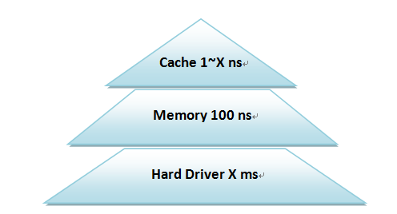

从这个图中，我们可以很明显的看出：**高速缓存的访问速度是主存的 10~100 倍，而主存的访问速度则是硬盘的 1～10W 倍。**

大概就是走路和坐飞机的差别了。虽然坐飞机是飞一样的感觉，但是走路还是我们最常用的移动方式。数据存储也一样，对于一台独立的计算机，数据最后还是要落地到磁盘上。所以，我们来看看机械硬盘的结构。

==== 机械硬盘结构

机械硬盘中的大致结构如下图，类似很多电影和电视剧中的留声机：

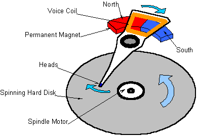

机械硬盘中，每一个磁盘盘面的组成结构如下：

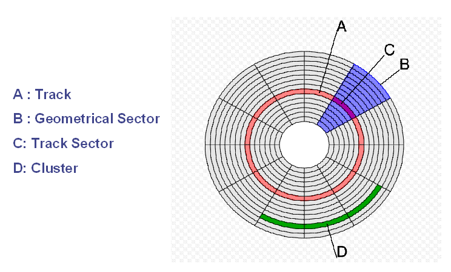

英文名词解释：

* Spindle Motor 主轴马达
* Permanent Magnent 永久磁铁
* Voice Coil 音圈
* Head 磁头
* Spinning Hard Disk 旋转的硬盘

每个机械磁盘都有很多个盘面组成。整个机械磁盘的组成结构如下：

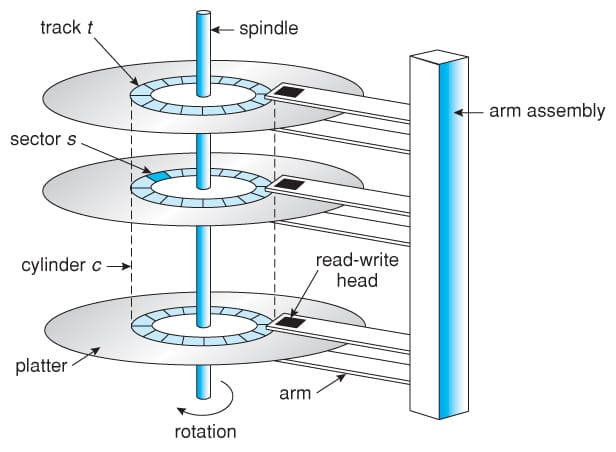

单词解释：

* spindle 转轴，主轴
* track 磁道
* sector 扇区
* cylinder 磁柱
* platter 磁盘
* head 磁头
* arm 磁臂
* 机械臂组件

//

寻道时间:: T-seek 是指将读写磁头移动至正确的磁道上所需要的时间。寻道时间越短，I/O操作越快，目前磁盘的平均寻道时间一般在 3－15ms。
旋转延迟:: T-rotation 是指盘片旋转将请求数据所在扇区移至读写磁头下方所需要的时间。旋转延迟取决于磁盘转速，通常使用磁盘旋转一周所需时间的 1/2 表示。比如，7200 rpm 的磁盘平均旋转延迟大约为 60 * 1000 / 7200 / 2 = 4.17ms，而转速为 15000 rpm 的磁盘其平均旋转延迟为 2ms。
数据传输时间:: T-transfer 是指完成传输所请求的数据所需要的时间，它取决于数据传输率，其值等于数据大小除以数据传输率。目前 IDE/ATA 能达到 133MB/s，SATA II 可达到 300MB/s 的接口数据传输率，数据传输时间通常远小于前两部分消耗时间。简单计算时可忽略。

*常见磁盘平均物理寻道时间为：*

* 7200  转/分的 STAT 硬盘平均物理寻道时间是 9ms
* 10000 转/分的 STAT 硬盘平均物理寻道时间是 6ms
* 15000 转/分的 STAT 硬盘平均物理寻道时间是 4ms

*常见硬盘的旋转延迟时间为：*

* 7200  rpm的磁盘平均旋转延迟大约为 60*1000/7200/2  = 4.17ms
* 10000 rpm的磁盘平均旋转延迟大约为 60*1000/10000/2 = 3ms，
* 15000 rpm的磁盘其平均旋转延迟约为 60*1000/15000/2 = 2ms。

了解磁盘读取数据的原理以各种延迟后，我们再来看看顺序读取和随机读取的差别：

因为机械硬盘的磁头移动至正确的磁道上需要时间，随机读写时，磁头不停的移动，时间都花在了磁头寻道上，导致的就是性能不高。所以，对于机械硬盘来说，连续读写性很好，但随机读写性能很差。具体对比如下：

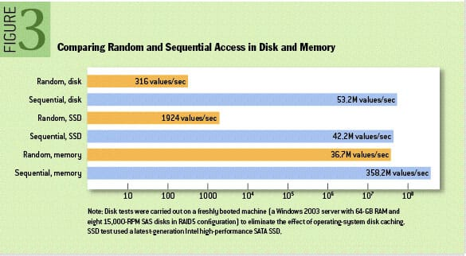

加州大学 Berkeley 分校统计的各种读取介质的延迟： https://people.eecs.berkeley.edu/~rcs/research/interactive_latency.html[Numbers Every Programmer Should Know By Year]

==== 局部性原理与磁盘预读

由于存储介质的特性，硬盘本身存取就比主存慢很多，再加上机械运动耗费，硬盘的存取速度往往是主存的几百分分之一，因此为了提高效率，要尽量减少磁盘 I/O。由于磁盘顺序读取的效率很高（不需要寻道时间，只需很少的旋转时间），因此对于具有局部性的程序来说，预读可以提高 I/O 效率。磁盘往往也不是严格按需读取，而是每次都会预读，即使只需要一个字节，磁盘也会从这个位置开始，顺序向后读取一定长度的数据放入内存。这样做的理论依据是计算机科学中著名的局部性原理：

*当一个数据被用到时，其附近的数据也通常会马上被使用。*

MySQL 在读取的时候，并不是每条每条读取，而是每次读取一页，一页通常包含好多条。

接下来，我们了解一下算法相关的背景知识。

[TIP]
====
我提到的问题：如何在一堆数据中查找某个数据？

从这些硬件上来看，在内存中，甚至在一二三级高速缓存中，查找最快。当然，前提是，这些存储足够存得下。
====

==== 时间复杂度

时间复杂度用来检验某个算法处理一定量的数据要花多长时间。

重要的不是数据量，而是当数据量增加时运算如何增加。

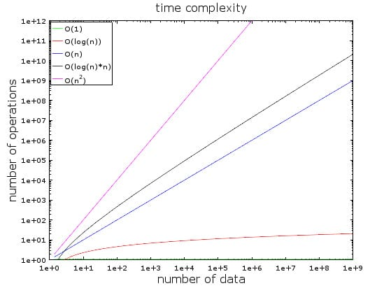

* 绿：O(1)
* 蓝：O(n)
* 红：O(latexmath:[log_{2}n]) 即使在十亿级数量时也很低
* 粉：O(latexmath:[n^2]) 快速膨胀

[NOTE]
====
*一些必要的知识点*

1 秒(s)  +
= 1000 （10^3^） 毫秒(ms) +
= 1000000 （10^6^） 微秒(μs) +
= 1000000000 （10^9^） 纳秒(ns)

对数计算公式::
latexmath:[log_{b}{a} = \frac{lna}{lnb}] -- 一般科学计算器都提供 latexmath:[ln{N}] 的计算，可以通过这个公式来计算 latexmath:[log_{2}{N}]。
====

数据量低时，O(1) 和 O(n^2^)的区别可以忽略不计。粗略计算，假设现在的计算机每秒可以处理 1* 10^9^ 条指令每秒。比如，你有个算法要处理2000条元素。

* O(1) 算法会消耗 1 次运算
* O(latexmath:[log_{2}n]) 算法会消耗 7 次运算
+
latexmath:[\frac{log_{2}(2*10^{3}) 条指令}{10^{9} 条指令/秒} = 1.10 * 10^{-8} 秒 = 11 纳秒]
* O(n) 算法会消耗 2000 次运算
+
latexmath:[\frac{2*10^{3} 条指令}{10^{9} 条指令/秒} = 2 * 10^{-6} 秒 = 2 微妙]
* O(latexmath:[n*log_{2}n]) 算法会消耗 14,000 次运算
+
latexmath:[\frac{(2*10^3)*log_{2}(2*10^3) 条指令}{10^{9} 条指令/秒} = 2.19*10^{-5} 秒 = 21.9 微秒]
* O(latexmath:[n^2]) 算法会消耗 4,000,000 次运算
+
latexmath:[\frac{(2*10^3)^{2} 条指令}{10^{9} 条指令/秒} = 4.00 * 10^{-3} 秒 = 4 毫秒]

在数据量非常小的情况下，最快 4 毫秒，最慢也只有 11 纳秒。人类几乎感知不出什么差别。但是，如果处理 1,000,000 条元素（这对数据库来说也不算大）。

* O(1) 算法会消耗 1 次运算
* O(latexmath:[log_{2}n]) 算法会消耗 14 次运算
+
latexmath:[\frac{log_{2}10^{6} 条指令}{10^{9} 条指令/秒} = 1.99 * 10^{-8} 秒 = 19.9 纳秒]
* O(n) 算法会消耗 1,000,000 次运算
+
latexmath:[\frac{10^{6} 条指令}{10^{9} 条指令/秒} = 1 * 10^{-3} 秒 = 1 毫秒]
* O(latexmath:[n*log_{2}n]) 算法会消耗 14,000,000 次运算
+
latexmath:[\frac{10^6*log_{2}10^{6} 条指令}{10^{9} 条指令/秒} = 1.99*10^{-2} 秒 = 19.9 毫秒]
* O(latexmath:[n^2]) 算法会消耗 1,000,000,000,000 次运算
+
latexmath:[\frac{(10^6)^{2} 条指令}{10^{9} 条指令/秒} = 1.00 * 10^{3} 秒 = 1000 秒]

**O(latexmath:[n^2]) 与 O(latexmath:[n*log_{2}n]) 相差了 latexmath:[\frac{1.00 * 10^{3}}{1.99*10^{-2}} = 502512.56] 倍。**我们把数据扩大到 10,000,000 条元素：

* O(1) 算法会消耗 1 次运算
* O(latexmath:[log_{2}n]) 算法会消耗 23.25 次运算
+
latexmath:[\frac{log_{2}10^{7} 条指令}{10^{9} 条指令/秒} = 2.33 * 10^{-8} 秒 = 23.3 纳秒]
* O(n) 算法会消耗 10,000,000 次运算
+
latexmath:[\frac{10^{7} 条指令}{10^{9} 条指令/秒} = 1 * 10^{-2} 秒 = 10 毫秒]
* O(latexmath:[n*log_{2}n]) 算法会消耗 232,500,000 次运算
+
latexmath:[\frac{10^7*log_{2}10^{7} 条指令}{10^{9} 条指令/秒} = 2.33*10^{-1} 秒 = 0.233 秒]
* O(latexmath:[n^2]) 算法会消耗 100,000,000,000,000 次运算
+
latexmath:[\frac{(10^7)^{2} 条指令}{10^{9} 条指令/秒} = 1.00 * 10^{5} 秒 = 27.78 小时]

**O(latexmath:[n^2]) 与 O(latexmath:[n*log_{2}n]) 相差了 latexmath:[\frac{1.00 * 10^{5}}{0.233} = 429184.5] 倍。**

这里可以明白：

* 搜索一个好的哈希表会得到 O(1) 复杂度
* 搜索一个均衡的树会得到 O(log(n)) 复杂度
* 搜索一个阵列会得到 O(n) 复杂度
* 最好的排序算法具有 O(n*log(n)) 复杂度
* 糟糕的排序算法具有 O(n^2^) 复杂度

[TIP]
====
我提到的问题：如何在一堆数据中查找某个数据？

在条件允许的情况下，我们应该选择时间复杂度尽量小的算法。
====

==== 归并排序

合并排序基于这样一个技巧：将 2 个大小为 N/2 的已排序序列合并为一个 N 元素已排序序列仅需要 N 次操作。这个方法叫做合并。

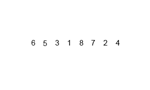

这个算法有两点特别棒的优势：

* 可以更改算法，以便于同时使用磁盘空间和少量内存而避免巨量磁盘 I/O。方法是只向内存中加载当前处理的部分。在仅仅100MB的内存缓冲区内排序一个几个GB的表时，这是个很重要的技巧。
* 可以更改算法，以便于在多处理器/多线程/多服务器上运行。 分布式归并排序时 Hadoop 的关键组件之一。

==== 二分查找

image::assets/images/binary_search_23.gif[title="二分查找-最好情况", alt="二分查找", width="95%"]

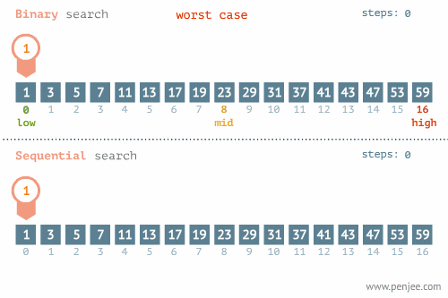

[TIP]
====
我提到的问题：如何在一堆数据中查找某个数据？

二分查找需要讲数组全部加载到内存中。但是，如果数据量特别大，加载不完，怎么办呢？能否只加载一部分数据呢？
====

==== 树

树，这种数据结构就能满足我们的需求，我们可以只把树的上面几级保存到内存中，方便操作。如下图：

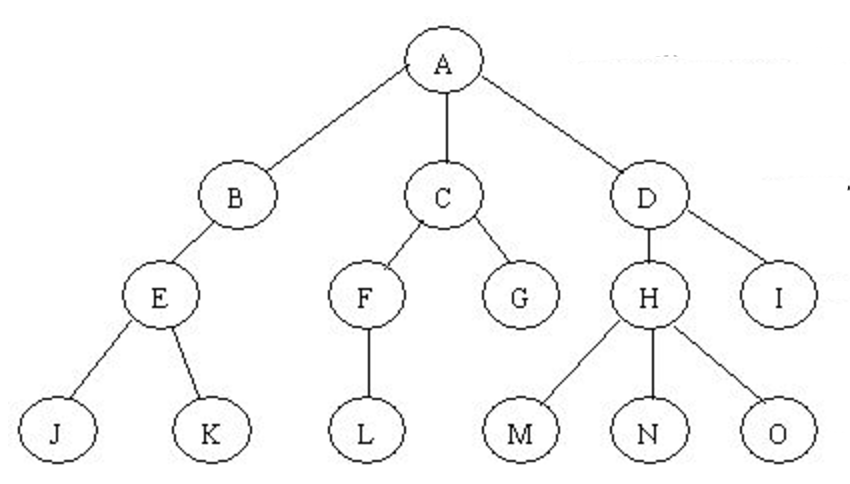

树的节点也可以保持有序状态：

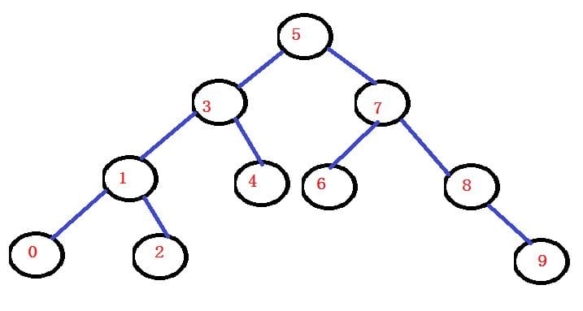

我们来看一下最简单的树结构。

[TIP]
====
我提到的问题：如何在一堆数据中查找某个数据？

树能否保持有序呢？
====

==== 二叉查找树

在二叉查找树和在有序数组中查找某一个指定元素的对比如下：

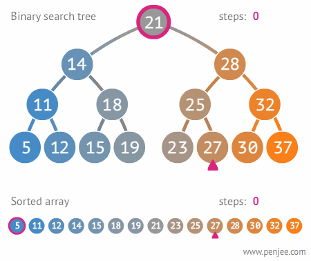

二叉查找树中每个节点要保证两点：

* 比保存在左子树的任何键值都要大
* 比保存在右子树的任何键值都要小

这个查询的成本是 log~2~(n)。

http://www.cs.usfca.edu/~galles/visualization/BST.html[二叉查找树在线演示]

上面的是理想状况下的情况。但在极端情况下，二叉查找树的查询成本有可能是 n。例如：

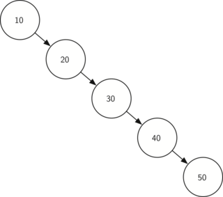

[TIP]
====
我提到的问题：如何在一堆数据中查找某个数据？

能否能避免这种极端情况出现呢？
====

==== 平衡二叉查找树

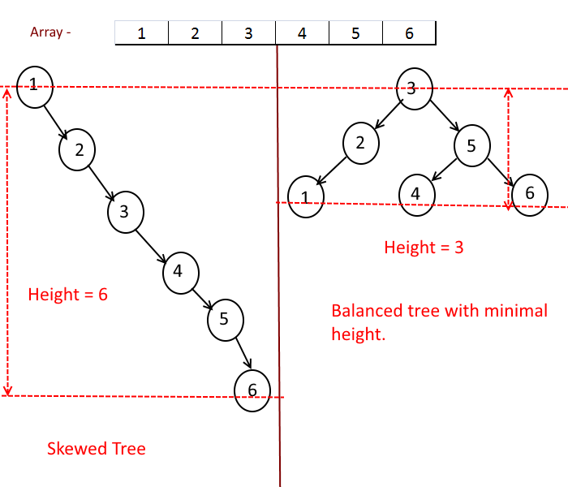

平衡二叉搜索树在添加元素时，通过旋转来保证自身的平衡性。

image::assets/images/tree_balance.png[title="平衡二叉搜索树旋转", alt="平衡二叉搜索树旋转", width="95%"]

不仅能左旋，还可以右旋。左右旋转示意图：

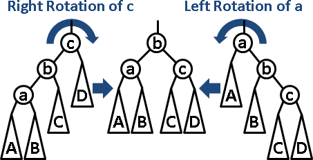

[TIP]
====
我提到的问题：如何在一堆数据中查找某个数据？

对于查找一个特定值这种树挺好用。还有一个问题：如果查找一个范围内的值呢？比如年龄大于 16，小于 29 的美女呢？这个还可以枚举。如果不能枚举，怎么搞？
====

==== B+Tree

为了解决高效查找某一个范围内的元素的问题，我们引入一个修订后的树：B+树。这也是目前大部分现代数据库索引使用的数据结构。在一个B+树里：

* 只有最底层的节点（叶子节点）才保存信息（相关表的行位置）
* 其它节点只是在搜索中用来指引到正确节点的。

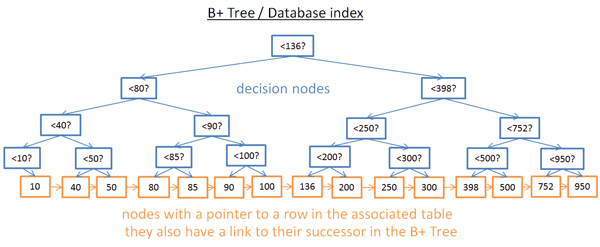

找到了 M 个后续节点，树总共有 N 个节点。对指定节点的搜索成本是 log(N)，跟上一个树相同。但是当你找到这个节点，你得通过后续节点的连接得到 M 个后续节点，这需要 M 次运算。那么这次搜索只消耗了 M+log(N) 次运算，区别于上一个树所用的 N 次运算。

WARNING: B+树种的 B 不是代表二叉（binary），而是代表平衡（balance），因为 B+树是从最早的平衡二叉树演化而来，但是 B+树不是一个二叉树。

[TIP]
====
我提到的问题：如何在一堆数据中查找某个数据？

有没有更快的查找算法呢？
====

==== 哈希表

为了构建一个哈希表，你需要定义：

* 元素的关键字
* 关键字的哈希函数。关键字计算出来的哈希值给出了元素的位置（叫做哈希桶）。
* 关键字比较函数。一旦你找到正确的哈希桶，你必须用比较函数在桶内找到你要的元素。

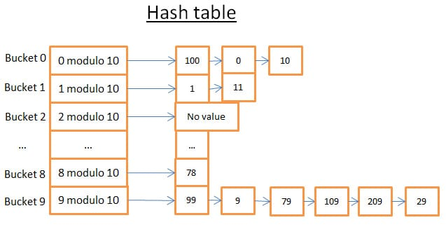

*真正的挑战是找到好的哈希函数，让哈希桶里包含非常少的元素。如果有了好的哈希函数，在哈希表里搜索的时间复杂度是 O(1)。*

[TIP]
====
我提到的问题：如何在一堆数据中查找某个数据？

Hash查找有什么问题吗？
====

[[index-innodb-logical-storage-structure]]
=== InnoDB 逻辑存储结构

所有数据都被逻辑地存放在一个空间中，称为表空间（tablespace）。表空间由段（segment）、区（extent）、页（page）组成。页在一些文档中有时也被称为块（block）。大致结构如下：

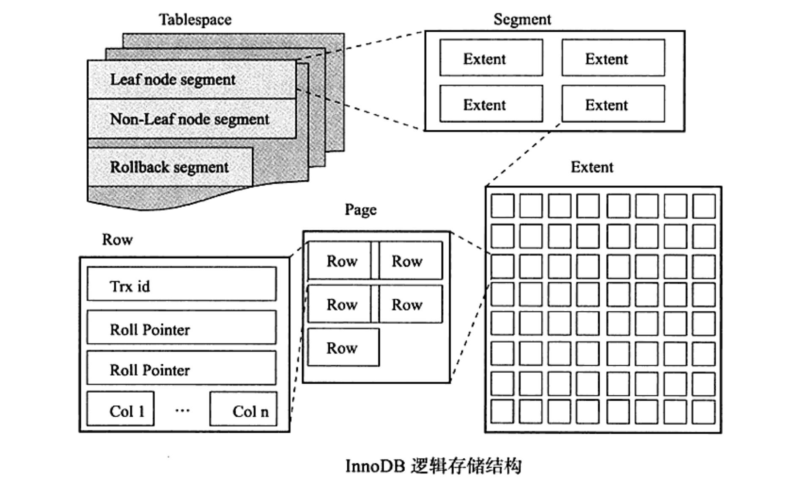

==== 行

InnoDB 存储引擎是面向列的（row-oriented），也就是说数据是按行进行存放的。每个页存放的行记录是有硬性定义的，最多允许存放 16KB / 2-200 行的记录，即 7992 行记录。

[[index-basis]]
=== 索引基础

索引类似书籍目录。

在MySQL 中，索引是在存储引擎层而不是服务器层实现的。

==== 索引类型

===== B-Tree 索引

大部分 MySQL 引擎都支持 B-Tree 索引。

NDB 集群存储引擎内部实际使用了 T-Tree 结构； InnoDB 则使用的是 B+Tree。

MyISAM 使用前缀压缩技术是索引更小；

MyISAM 索引通过数据的物理位置引用被索引的行，而 InnoDB 则根据逐渐引用被索引的行。

B-Tree 通常以为这所有的值都是按顺序存储的，并且每一个叶子页到根的距离相同。如下图：

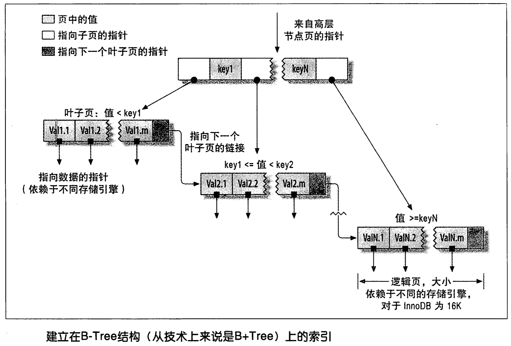

B-Tree 索引能够加快访问数据的速度，因为存储引擎不再需要进行全表扫描来获取需要的数据，取而代之的是从索引的根节点开始进行搜索。

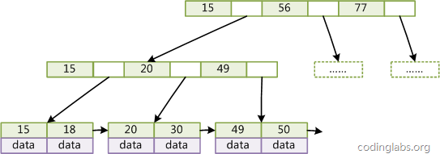

WARNING: 问：索引的根节点的值变还是不变？

叶子节点比较特别，他们的指针指向的是被索引的数据，而不是其他的节点页。

树的深度和表的大小直接相关。

B-Tree 对索引列是顺序组织存储的，所以很适合查找范围数据。

例如：

[{sql_source_attr}]
----
CREATE TABLE people (
  last_name  VARCHAR(50)     NOT NULL,
  first_name VARCHAR(50)     NOT NULL,
  dob        DATE            NOT NULL,
  gender     ENUM ('m', 'f') NOT NULL,
  KEY (last_name, first_name, dob)
);
----

三个列组成的联合索引的结构如下：

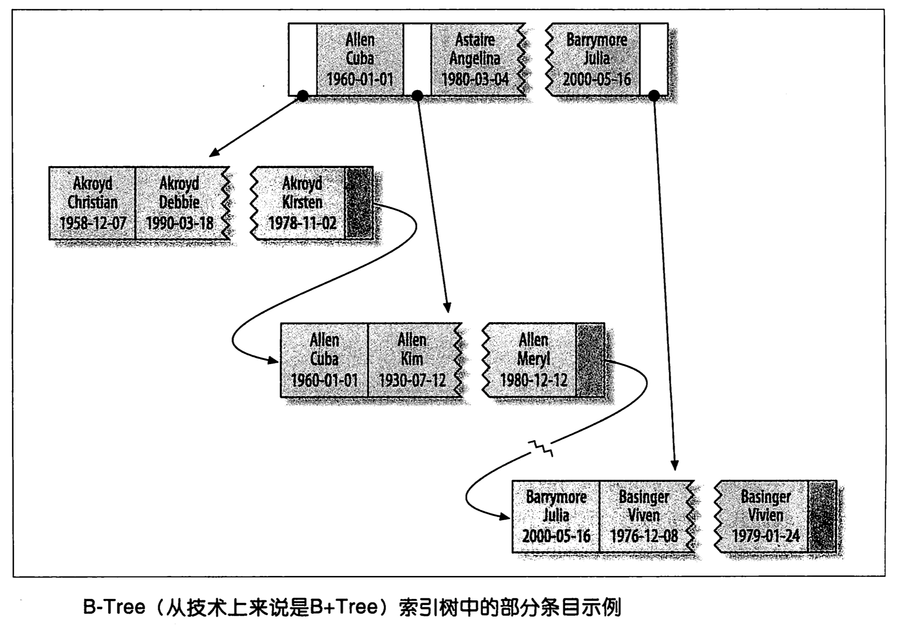

注意：索引对多个值进行排序的依据是 `CREATE TABLE` 语句中定义索引时列的顺序。

B-Tree 索引有效的查询：

全值匹配:: 全值匹配指的是和索引中的所有列进行匹配。
匹配最左前缀:: 只使用索引前面的列。
匹配列前缀:: 也可以只匹配某一列的值的开头部分。
匹配范围值:: 比如只匹配名字
精确匹配某一列并范围匹配另外一列:: 精确匹配第一列，范围匹配第二列。
只访问索引的查询:: 查询只需要访问索引，而无须访问数据行。“覆盖索引”。

是因为索引树种的节点是有序的，除了查找之外，还可以用于查询中的 `ORDER BY` 操作。一般来说，**如果 B-Tree 可以按照某种方式查找到值，那么也可以按照这种方式用于排序。所以，如果 `ORDER BY` 子句满足前面列出的几种查询类型，则这个索引页可以满足对应的排序需求。**

B-Tree 索引的限制：

* 如果不是按照索引的最左列开始查找，则无法使用索引。
* 不能跳过索引中的列。
* 如果查询中有某个列的范围查询，则其右边所有列都无法使用索引优化查找。

再次提醒：索引列的顺序是多么重要，这些限制都和索引列的顺序有关。**在优化性能的时候，可能需要使用相同的列但顺序不同的索引来满足不同类型的查询需求。**

B+树索引并不能找到一个给定键值的具体行。B+树索引能找到的只是被查找数据行所在的页。然后数据库通过把页读入到内存，再在内存中进行查找，最后得到要查找的数据。

===== 哈希索引

哈希索引（hash index）基于哈希表实现，只有精确匹配查询索引所有列的查询才有效。

在 MySQL 中，只有 Memory 引擎显式支持哈希索引。 Memory 引擎是支持 非唯一哈希索引的。

[{sql_source_attr}]
----
CREATE TABLE hash_test (
  fname VARCHAR(50) NOT NULL,
  lname VARCHAR(50) NOT NULL,
  KEY USING HASH (fname) -- <1>
) ENGINE = MEMORY; -- <2>
----
<1> 建立哈希索引的方式
<2> 指定引擎的方式

如果多个列的哈希值相同，索引会以链表的方式存放多个记录指针到同一个哈希条目中。

哈希索引的限制：

* 哈希索引只包含哈希值和行指针，而不存储字段值，所以不能使用索引中的值来避免读取行。
* 哈希索引数据并不是按照索引值顺序存储的，所以也就无法用于排序。
* 哈希索引也不支持部分索引列匹配查找，因为哈希索引始终是使用索引列的全部内容来计算哈希值的。
* 哈希索引只支持等值比较查询，包括 `=`、 `IN()`、 `<=>`(注意 `<>` 和 `<=>` 是不同的操作)。
* 访问哈希索引的数据非常快，除非有很多哈希冲突。哈希冲突时使用链表来解决哈希冲突。
* 如果哈希冲突很多的话，一些所以维护操作的代价也会很高。冲突越多，代价越大。

因为这些限制，哈希索引只适用于某些特定的场合。而一旦适合哈希索引，则它带来的性能提升将非常显著。

除了 Memory 索引外，NDB 集群引擎也支持唯一哈希索引，且在 NDB 集群引擎中作用非常特殊。

InnoDB 引擎有一个特殊的功能叫“自适应哈希索引（adaptive hash index）”。当 InnoDB 注意到某些索引值使用得特别频繁时，它会在内存中基于 B-Tree 索引之上再创建一个哈希索引，这样就让 B-Tree 索引也具有哈希索引的一些优点，比如快速的哈希查找。这是一个完全自动的、内部的行为，用户无法控制或者配置，如有必要，可以关闭。

*创建自定义哈希索引*

如果存储引擎不支持哈希索引，可以模拟 InnoDB 一样创建哈希索引。思路：在 B-Tree 基础上创建一个伪哈希索引。并不是真正的哈希索引，本质还是使用 B-Tree 进行查找，但它使用哈希值而不是键本身进行查找。需要做的就是在查询的 `WHERE` 子句中手动指定使用哈希函数。

.以 URL 列为例的自定义哈希索引
[{sql_source_attr}]
----
SELECT id
FROM url
WHERE url='http://www.diguage.com/';

-- 创建自定义哈希索引
-- 注意：这里需要在 url_crc 字段上创建索引
SELECT id
FROM url
WHERE url='http://www.diguage.com/'
    AND url_crc=CRC32('http://www.diguage.com/');

-- 另外一种方式就是对完整的 URL 字符串做索引，那样会非常慢。
----

自定义哈希索引的缺陷是需要维护哈希值。可以手动维护，也可以使用触发器实现。示例如下：

.基于触发器的自定义哈希索引
[{sql_source_attr}]
----
DROP TABLE IF EXISTS url;
CREATE TABLE url (
  id      INT UNSIGNED NOT NULL AUTO_INCREMENT,
  url     VARCHAR(255) NOT NULL,
  url_crc INT UNSIGNED NOT NULL DEFAULT 0,
  PRIMARY KEY (id),
  KEY (url_crc)  -- <1>
);

DELIMITER //

-- 插入触发器
CREATE TRIGGER url_crc_ins
BEFORE INSERT ON url
FOR EACH ROW BEGIN
  SET new.url_crc = crc32(new.url);
END;

-- 更新触发器
CREATE TRIGGER url_crc_upd
BEFORE UPDATE ON url
FOR EACH ROW BEGIN
  SET new.url_crc = crc32(new.url);
END;

INSERT INTO url (url) VALUES ('http:\/\/www.diguage.com/');

SELECT *
FROM url; -- <2>

UPDATE url
SET url = 'http:\/\/www.diguage.com'
WHERE id = 1;

SELECT *
FROM url; -- <2>

SELECT id
FROM url
WHERE url_crc = crc32('http:\/\/www.diguage.com/')
      AND url = 'http:\/\/www.diguage.com/'; -- <3>
----
<1> 这个索引必须创建。
<2> 注意查看查询结果中的 `url_crc` 字段的值。
<3> 为避免冲突问题，使用哈希索引查询时，必须在 `WHERE` 子句中包含常量值。

生日悖论，出现哈希冲突的概率的增长速度可能比想象的要快得多。

[{sql_source_attr}]
----
SELECT
  CRC32('gnu'),
  CRC32('codding');
----

TIP: 可以把哈希索引的实现原理对比 `HashMap` 的代码实现。

采用这种方式，记住**不要使用 `SHA1()` 和 `MD5()` 作为哈希函数。**因为这两个函数计算出来的哈希值是非常长的字符串，会浪费大量空间，更新时也会更慢。 `SHA1()` 和 `MD5()` 设计目标是最大限度消除冲突，但这里并不需要这样高的要求。简单哈希函数的冲突在一个可以接受的范围，同时又能够提供更好的性能。

如果数据表非常大， `CRC32()` 会出现大量的哈希冲突，则可以实现一个简单的 64 位哈希函数。一个简单的办法可以使用 `MD5()` 函数返回值的一部分来作为自定义函数。性能稍差，但实现简单。

[{sql_source_attr}]
----
SELECT CONV(RIGHT(MD5('http:\/\/www.diguage.com/'), 16), 16, 10) AS hash64;
----

===== 空间数据索引（R-Tree）

MyISAM 表支持空间索引，可以用作地理数据存储。空间索引会从所有唯独来索引数据。查询时，可以有效地使用任意维度来组合查询。必须使用 MySQL 的 GIS 相关函数如 `MBRCONTAINS()` 等来维护数据。

开源关系数据库系统中对 GIS 的解决方案做得比较好的是 PostgreSQL 的 PostGIS。

===== 全文索引

全文索引时一种特殊类型的索引，它查找的是文本中的关键词，而不是直接比较索引中的值。

全文索引更类似于搜索引擎做的事情，而不是简单的 `WHERE` 条件匹配。

全文索引适用于 `MATCH AGAINST` 操作，而不是普通的 `WHERE` 条件查询。

===== 分形树索引（fractal tree index）

这是一类比较新开发的数据结构，既有 B-Tree 的很多优点，也避免了 B-Tree 的一些缺点。

[[index-advantage]]
=== 索引的优点

索引可以快速定位到表的指定位置；可以用作 `ORDER BY` 和 `GROUP BY` 操作；某些查询只使用索引就能够完成全部查询。

索引的三个有点：

. 索引大大减少了服务器需要扫描的数据量。
. 索引可以帮助服务器避免排序和临时表。
. 索引可以将随机 I/O 变为顺序 I/O 。

关于索引推荐阅读 Tapio Lahdenmaki 和 Michael Leach 编写的 https://book.douban.com/subject/26419771/[数据库索引设计与优化]，该书详细介绍了如何计算索引的成本和作用、如何评估查询速度、如何分析索引维护的代价和其带来的好处等。

[[three-star-system]]
Tapio Lahdenmaki 和 Michael Leach 在书中介绍了如何评价一个索引是否适合某个查询的“三星系统”（three-star system）：

. 索引将相关的记录放到一起则获得一星；
. 如果索引中的数据顺序和查找中的排列顺序一致则获得二星；
. 如果索引中的列包含了查询中需要的全部列则获得“三星”。

.索引时最好的解决方案吗？
****
索引不总是最好的工具。只有当索引帮助存储引擎快速查找到记录带来的好处大于其带来的额外工作时，索引才是有效的。对于非常小的表，大部分情况下简单全表扫描更高效。对于中到大型的表，索引就非常有效。但对于特大型的表，建立和使用索引的代价将随之增长。这时就需要分区技术。

如果表的数量特别多，可以建立一个元数据信息表，用于查询需要用到的某些特性。例如

// TODO 接下来补充吧！！

对于 TB 级别的数据，定位单条记录的意义不大，所以需要经常会使用块级别元数据技术来替代索引。
****

[[index-high-performance-strategy]]
=== 高性能的索引策略

正确地创建和使用索引时实现高性能查询的基础。

==== 独立的列

“独立的列”是指索引列不能是表达式的一部分，也不能是函数的参数。

应该养成简化 `WHERE` 条件的习惯，始终将索引列单独放在比较符合的一侧。

.对比独立列与
[{sql_source_attr}]
----
USE sakila;

# 带数学计算的例子
EXPLAIN
SELECT actor_id
FROM actor
WHERE actor_id + 1 = 5 \G
*************************** 1. row ***************************
           id: 1
  select_type: SIMPLE
        table: actor
   partitions: NULL
         type: index
possible_keys: NULL
          key: idx_actor_last_name
      key_len: 182
          ref: NULL
         rows: 200
     filtered: 100.00
        Extra: Using where; Using index

# 独立列
EXPLAIN
SELECT actor_id
FROM actor
WHERE actor_id = 4 \G
*************************** 1. row ***************************
           id: 1
  select_type: SIMPLE
        table: actor
   partitions: NULL
         type: const
possible_keys: PRIMARY
          key: PRIMARY
      key_len: 2
          ref: const
         rows: 1
     filtered: 100.00
        Extra: Using index
----

==== 前缀索引和索引选择性

当索引很长的字符列，会让索引变得大且慢，一个策略是前面提到过的模拟哈希索引。

通常可以索引开始的部分字符，可以大大节约索引空间，从而提高索引效率。但这样会降低索引的选择性。

索引的选择性是指，不重复的索引值（也称为基数，cardinality）和数据表的记录总数（#T）的比值，范围从 1/#T 到1之间。索引的选择性越高则查询效率越高，因为选择性高的索引可以让 MySQL 在查找时过滤掉更多的行。唯一索引的选择性是 1，这是最好的索引选择性，性能也是最好的。

一般情况下某个列前缀的选择性也是足够高的，足以满足查询性能。对于 `BLOB`、 `TEXT` 或者很长的 `VARCHAR` 类型的列，必须使用前缀索引。

诀窍在于要选择足够长的前缀以保证较高的选择性，同时又不能太长（以便节约空间）。前缀应该足够长，以是的前缀索引的选择性接近于索引整个列。换句话说，前缀的“基数”应该接近于完整列的“基数”。

为了觉得前缀的合适长度，需要找到最常见的值的列表，然后和最常见的前缀列表进行比较。

.使用 SQL 语句来查看前缀长度的选择性
[{sql_source_attr}]
----
USE sakila;

# 字符串长度统计
SELECT
  CHAR_LENGTH(city) AS len,
  count(*)          AS cnt
FROM city
GROUP BY len
ORDER BY len DESC;

+-----+-----+
| len | cnt |
+-----+-----+
|  26 |   3 |
|  23 |   4 |
|  22 |   2 |
|  21 |   2 |
|  20 |   4 |
|  19 |   5 |
|  18 |   4 |
|  17 |   7 |
|  16 |   6 |
|  15 |   9 |
|  14 |   8 |
|  13 |   8 |
|  12 |  15 |
|  11 |  29 |
|  10 |  45 |
|   9 |  61 |
|   8 |  88 |
|   7 |  95 |
|   6 | 107 |
|   5 |  56 |
|   4 |  35 |
|   3 |   6 |
|   2 |   1 |
+-----+-----+

# 字符串选择性
SELECT
  COUNT(DISTINCT LEFT(city, 2)) / COUNT(*) AS cit2,
  COUNT(DISTINCT LEFT(city, 3)) / COUNT(*) AS cit3,
  COUNT(DISTINCT LEFT(city, 4)) / COUNT(*) AS cit4,
  COUNT(DISTINCT LEFT(city, 5)) / COUNT(*) AS cit5,
  COUNT(DISTINCT LEFT(city, 6)) / COUNT(*) AS cit6,
  COUNT(DISTINCT LEFT(city, 7)) / COUNT(*) AS cit7,
  COUNT(DISTINCT LEFT(city, 8)) / COUNT(*) AS cit8,
  COUNT(DISTINCT city) / COUNT(*)          AS city
FROM city;

+--------+--------+--------+--------+--------+--------+--------+--------+
| cit2   | cit3   | cit4   | cit5   | cit6   | cit7   | cit8   | city   |
+--------+--------+--------+--------+--------+--------+--------+--------+
| 0.3133 | 0.7633 | 0.9383 | 0.9750 | 0.9900 | 0.9933 | 0.9933 | 0.9983 |
+--------+--------+--------+--------+--------+--------+--------+--------+

# 再对比一下不同长度字符的分布情况
SELECT
  count(*)      AS cnt,
  left(city, 2) AS pref
FROM city
GROUP BY pref
ORDER BY cnt DESC; -- <1>

SELECT
  count(*)      AS cnt,
  left(city, 6) AS pref
FROM city
GROUP BY pref
ORDER BY cnt DESC; -- <1>
----
<1> 结果集太多，不再展示。

根据统计，我们只需要针对前六个字符建立前缀索引即可：

.建立前缀索引
[{sql_source_attr}]
----
CREATE INDEX idx_city_pre6
  ON city (city(10)); -- <1>

# 或
ALTER TABLE city
  ADD KEY (city(6)); -- <1>
----
<1> 注意：这里只取了 `city` 列前六个字符来建立索引。

前缀索引时一种能使索引更小、更快的有效办法；也有缺点，**MySQL 无法使用前缀索引做 `ORDER BY` 和 `GROUP BY`，也无法使用前缀索引做覆盖索引**。

一个常见的场景是针对很长的十六进制唯一 ID 使用前缀索引。例如 SessionID。

NOTE: 有时后缀索引(suffix index)也有用途。 MySQL 原生不支持反向索引，但可以把字符串反转后存储，并基于此建立前缀索引。可以通过触发器来维护这种索引。

==== 多列索引

一个常见的错误就是，为每个列创建独立的索引，或者按照错误的顺序创建多列索引。

在多个列上山里独立的单列索引大部分情况下并不能提高 MySQL 的查询性能。 MySQL 5.0 和更新版本引入了一种“索引合并”（index merge）的策略，一定程度上可以使用表上的多个单列索引来定位指定的行。

.索引合并
[{sql_source_attr}]
----
# 不支持索引合并就需要做全表扫描
SELECT
  film_id,
  actor_id
FROM film_actor
WHERE film_id = 1 OR actor_id = 1;

# 在支持索引合并前，只能这样优化
EXPLAIN
SELECT
  film_id,
  actor_id
FROM film_actor
WHERE actor_id = 1
UNION ALL
SELECT
  film_id,
  actor_id
FROM film_actor
WHERE film_id = 1 AND actor_id <> 1 \G
*************************** 1. row ***************************
           id: 1
  select_type: PRIMARY
        table: film_actor
   partitions: NULL
         type: ref
possible_keys: PRIMARY
          key: PRIMARY
      key_len: 2
          ref: const
         rows: 19
     filtered: 100.00
        Extra: Using index
*************************** 2. row ***************************
           id: 2
  select_type: UNION
        table: film_actor
   partitions: NULL
         type: range
possible_keys: PRIMARY,idx_fk_film_id
          key: idx_fk_film_id
      key_len: 4
          ref: NULL
         rows: 10
     filtered: 100.00
        Extra: Using where; Using index

# 支持索引合并后
EXPLAIN
SELECT
  film_id,
  actor_id
FROM film_actor
WHERE film_id = 1 OR actor_id = 1 \G
*************************** 1. row ***************************
           id: 1
  select_type: SIMPLE
        table: film_actor
   partitions: NULL
         type: index_merge
possible_keys: PRIMARY,idx_fk_film_id
          key: idx_fk_film_id,PRIMARY
      key_len: 2,2
          ref: NULL
         rows: 29
     filtered: 100.00
        Extra: Using union(idx_fk_film_id,PRIMARY); Using where
----

索引合并测试有时候是一种优化的结果，但**实际上更多时候说明了表上的索引建的很糟糕**：

* 当出现服务器对多个索引做相交操作时（通常有多个 `AND` 条件），通常意味着需要一个包含所有相关列的多列索引，而不是多个独立的单列索引。
* 当服务器需要多多个索引做联合操作时（通常有多个 `OR` 条件），通常需要耗费大量 CPU 和内存资源在算法的缓存、排序和合并操作上。特别是当有些索引的选择性不高，需要合并扫描返回的大量数据的时候。
* 更重要的是，优化器不会把这些计算的“查询成本”中，优化器只关心随机页面读取。这使得查询的成本被“低估”。

如果在 `EXPLAIN` 中看到有索引合并，应该好好检查一下查询和表的结构，看是不是已经是最优的。

[[choose-index-fields-sequence]]
==== 选择合适的索引列顺序

最容易引起困惑的问题就是索引列的顺序。正确的顺序依赖于使用该索引的查询，并且同时需要考虑如何更好地满足排序和分组的需要。本节内容适用于 B-Tree 索引。

在一个多列 B-Tree 索引中，索引列的顺序意味着索引首先按照最左列进行排序，其次是第二列，以此类推。所以，索引可以按照升序或者降序进行扫描，以满足精确符合列顺序的 `ORDER BY`、 `GROUP BY` 和 `DISTINCT` 等子句的查询需求。

在 Lahdenmaki 和 Leach 的<<three-star-system, “三星索引”>>系统中，列顺序也决定了一个索引是否能够成为一个真正的“三星索引”。

对于如何选择索引的列顺序有一个经验法则：**将选择性最高的列放到索引最前列。**通常不如避免随机 IO 和排序那么重要。

当不需要考虑排序和分组时，将选择性最高的列放到索引最前列通常是很好的。

[TIP]
====
这就是在思考建立联合索引时的一个指导原则！选择方法如下：
[{sql_source_attr}]
----
USE sakila; -- <1>

SELECT
  sum(staff_id = 2),
  sum(customer_id = 584)
FROM payment;
----
<1> 这里使用了 MySQL 官方提供的 sakila 示例数据库。

根据执行结果，结合上面提到的指导原则，应该讲结果值更小的列放在前面。

[WARNING]
=====
这里有个地方需要注意：上面查询的结构非常依赖于选定的具体值。对其他查询可能就不适用。
=====

经验法则考虑的是全局基数和选择性，而不是某个具体查询。

[{sql_source_attr}]
----
USE sakila;

SELECT
  COUNT(DISTINCT staff_id) / COUNT(*)    AS staff_id_selectivity,
  COUNT(DISTINCT customer_id) / COUNT(*) AS customer_id_selectivity,
  COUNT(*)
FROM payment;
----

根据执行结构，选择数字比较高的列作为索引列的第一列。
====

性能不只是依赖于所有索引列的选择性（整体基数），也和查询条件的具体值有关，也就是和值的分布有关。

可能需要根据那些运行效率最高的查询来调整索引列的顺序。

// TODO 这里还有一些内容需要仔细再看看。

尽管关于选择性和基数的经验法则值得去研究和分析，但一定要记住别忘了 `WHERE` 子句中的排序、分组和范围条件等其他因素，这些因素可能对查询的性能早晨非常大的影响。

==== 聚簇索引

聚簇索引并不是一种单独的索引类型，而是一种数据存储方式。InnoDB 的聚簇索引实际上在同一结构中保存了 B-Tree 索引和数据行。

当表有聚簇索引时，它的数据行实际上存放在索引的叶子页（leaf page）中。术语“聚簇”表示数据行和相邻的键值紧凑地存储在一起。因此，一个表只有一个聚簇索引（不过，覆盖索引可以模拟多个聚簇索引的情况）。

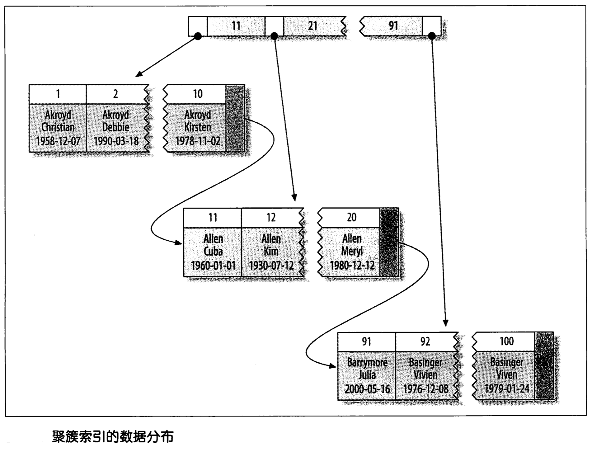

InnoDB 通过主键聚集数据。如果没有定义主键， InnoDB 会选择一个唯一的非空索引代替；如果没有这样的索引， InnoDB 会隐式定义哥主键来作为聚簇索引。

聚集的数据的一些重要的优点：

* 可以把相关数据保存在一起。例如，根据用户ID来聚集数据，可以顺序读取某个用户的全部邮件。
* 数据访问更快。聚簇索引将索引和数据保存在同一个 B-Tree 中，因此从聚簇索引中获取数据通常比非聚簇索引中查找要快。
* 使用覆盖索引扫描的查询可以直接使用页节点中的主键值。

聚集数据的一些缺点：

* 聚簇数据最大限度提高了 I/O 密集型应用的性能，但如果数据全部都放在内存中，则访问的顺序就没那么重要了，聚簇索引也就没什么优势了。
* 插入速度严重依赖于插入顺序。按照主键的顺序插入是加载数据到 InnoDB 表中速度最快的方式。但如果不是按照主键顺序加载数据，那么在加载完成后最好使用 `OPTIMIZE TABLE` 命令重新组织一下表。
* 更新聚簇索引列的代价很高，因为会强制 InnoDB 将每个被更新的行移动到新的位置。
* 基于聚簇索引的表在插入新行，或者主键被更新导致需要移动行的时候，可能面临“页分裂”的问题。页分裂会导致表占用更多的磁盘空间。
* 聚簇索引可能导致全表扫描变慢，尤其是行比较稀疏，或者由于页分裂导致数据存储不连续的时候。
* 二级索引（非聚簇索引）可能给想象的要更大，因为在二级索引的叶子节点包含了引用行的主键列。
* 二级索引访问需要两次索引查找，而不是一次。

二级索引叶子节点保存的不是指向行的物理位置的指针，而是行的主键值。二级索引要两次 B-Tree 查找而不是一次，对于 InnoDB，自适应哈希索引能够减少这样的重复工作。_为什么能减少？_

===== InnoDB 和 MyISAM 的数据分布对比

为了方便讲解，分别使用 InnoDB 和 MyISAM 引擎建立结构如下的表，并按主键随机顺序插入主键值在 1 ~ 10000 的10000条数据：

[{sql_source_attr}]
----
CREATE TABLE layout_test (
  col1 INT NOT NULL,
  col2 INT NOT NULL,
  PRIMARY KEY (col1),
  KEY (col2)
); -- <1>
----
<1> 请在建立的时候指定引擎类型

*MyISAM 的数据分布*

MyISAM 按照数据插入的顺序存储在磁盘上。如图：

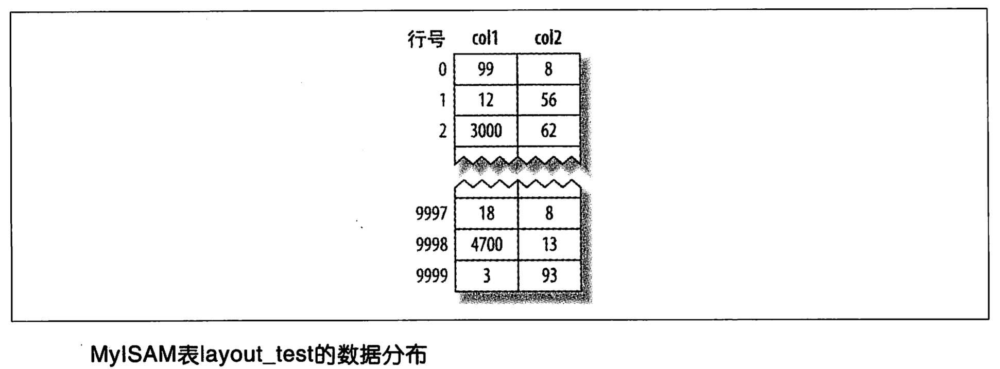

在行旁边显示了行号，从 0 开始递增。因为行是定长的，所以 MyISAM 可以从表的开头跳过所需要的字节找到需要的行。（MyISAM 是根据定长还是变长的行使用不同策略来确定行号。）

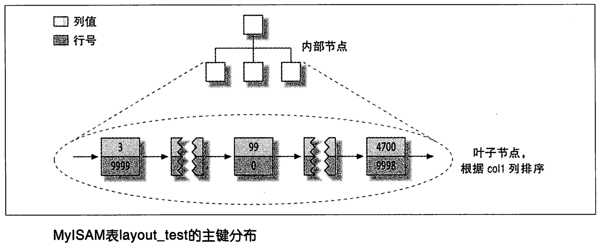

这里有两点需要注意：

. 主键叶子节点存放的指向数据行的指针。
. 主键和其他索引没有什么区别。

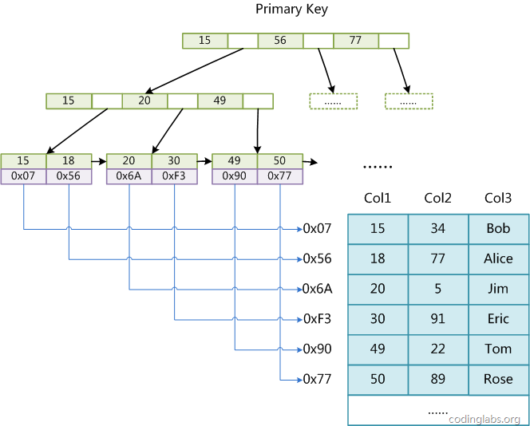

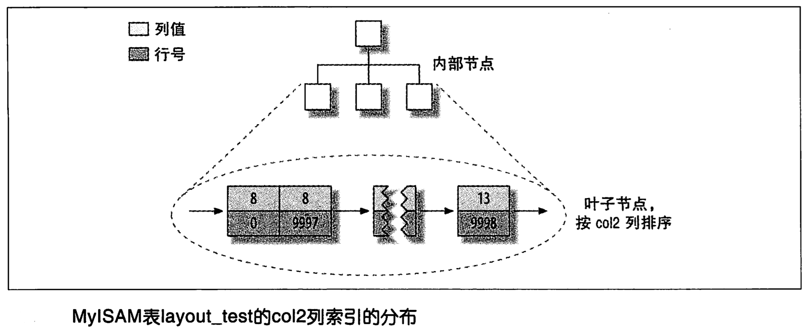

事实上， MyISAM 中主键索引和其他索引在结构上没有什么不同。主键索引就是一个名为 PRIMARY 的唯一非空索引。

*InnoDB 的数据分布*

InnoDB 支持聚簇索引，所以使用不同的方式存储同样的数据。

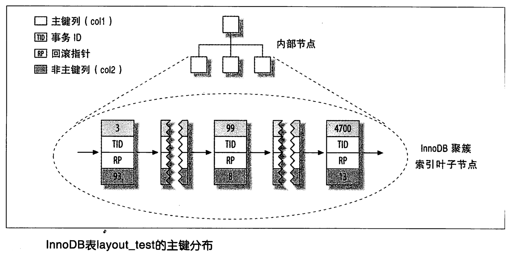

注意：该图显示了整个表，而不是只有索引。在 InnoDB 中，聚簇索引“就是”表。

聚簇索引的每一个叶子节点都包含了主键值、事务 ID、用于事务和 MVCC 的回滚指针以及所有的剩余列。如果主键是一个列前缀索引， InnoDB 也会包含完整的主键列和剩下的其他列。

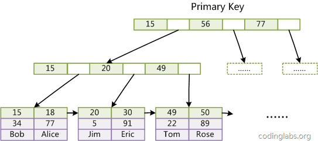

NOTE: 前文说 InnoDB 把 `BLOB` 类型的会放在单独区域，如果主键是 `BLOB` 类型的列前缀索引，该如何存储？

InnoDB 的二级索引和聚簇索引很不相同。 InnoDB 二级索引的叶子节点存储的不是“行指针”，而是主键值，并以此作为指向行的“指针”。这样的策略减少了当出现行移动或者数据页分裂时二级索引的维护。使用主键值当做指针会让二级索引占用更多的空间，换来的好处是， InnoDB 在移动行时无须更新二级索引中的这个“指针”。

TIP: 对比来看， MyISAM 在更新时，如果出现行移动，则要更新所有的二级索引的行指针。

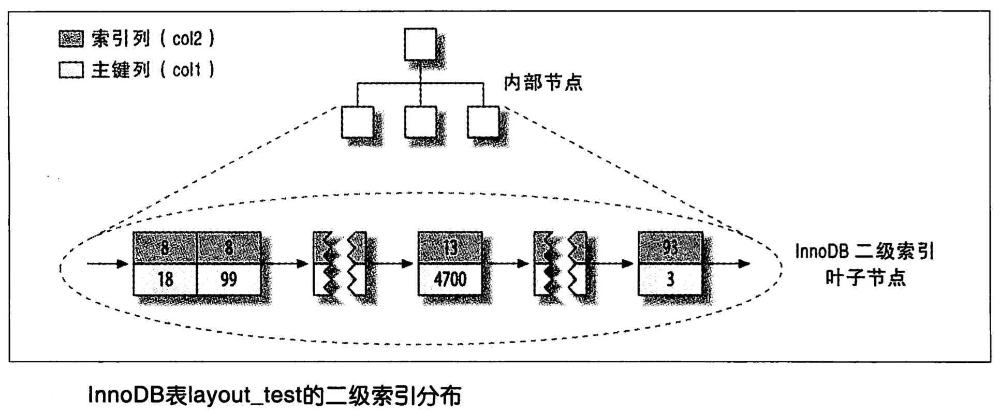

注意两点：

. 每个叶子节点都包含了索引列，紧接着是主键索引。
. 非叶子节点包含了索引列和一个指向下级节点的指针。这对聚簇索引和二级索引都是用。

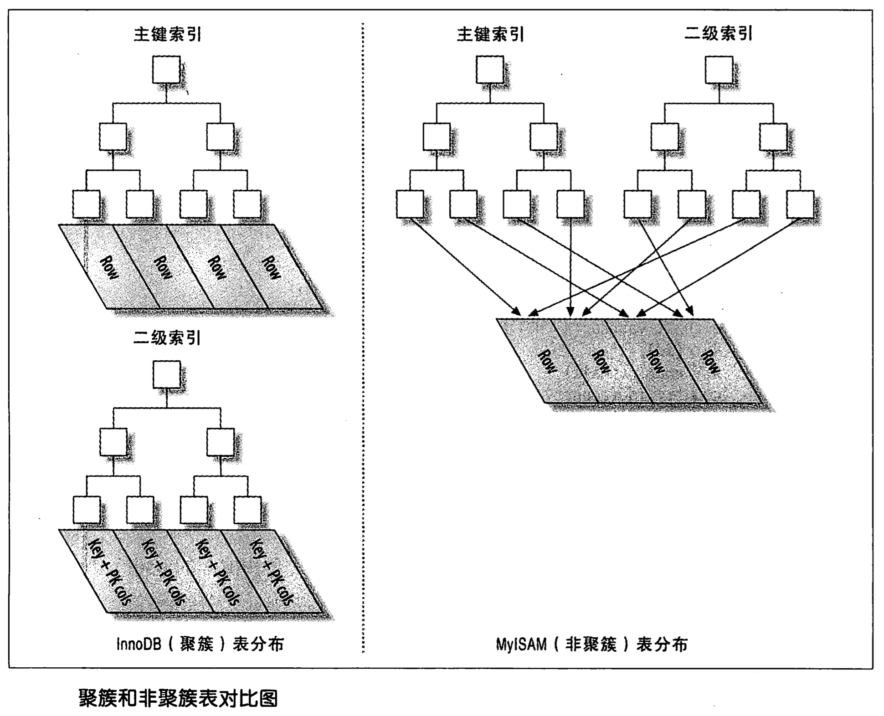

===== 在 InnoDB 表中按主键顺序插入行

保证数据行是按顺序写入，对于根据主键做关联操作的性能也会更好。

最好避免随机的（不连续且值的分布范围非常大）聚簇索引，特别是对于 I/O 密集型的应用。随机主键使得聚簇索引的插入变得完全随机，这是最坏的情况，使得数据没有任何聚集特性。

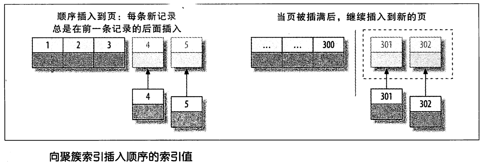

因为主键的值时顺序的，所以 InnoDB 把每一条记录都存储在上一条记录的后面。当达到页的最大填充因子时（InnoDB 默认的最大填充因子是页大小的 15/16，留出部分空间用于以后修改），下一条记录都会写入新的页中。一旦数据按照这种顺序的方式加载，主键页就会近似于被顺序的记录填满。

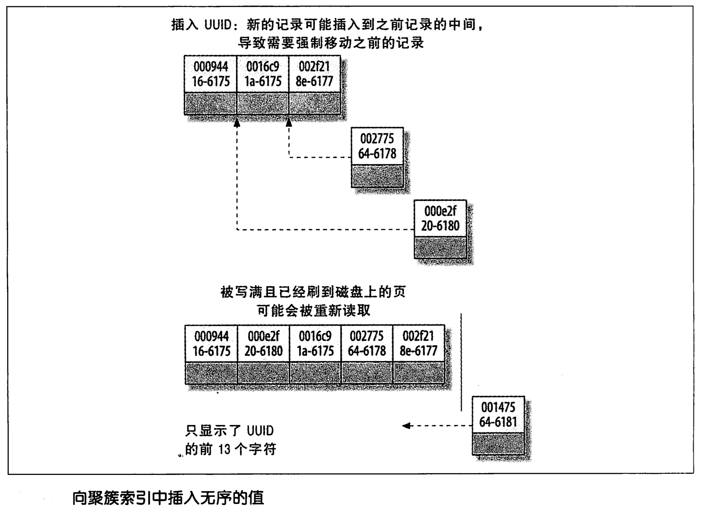

因为主键值不一定比之前插入的大，所以 InnoDB 无法简单地总是把新行插入到索引的最后，而是需要为新的行寻找合适的位置 -- 通常是已有数据的中间位置 -- 并且分开空间。这会增加很多额外的工作，并导致数据分布不够优化。缺点：

* 写入的目标页可能已经刷到磁盘上并从缓存中移除，或者是还没有被加载到缓存中， InnoDB 在插入之前不得不先找到并从磁盘读取目标页到内存中。这将导致大量的随机 I/O。
* 因为写入是乱序的， InnoDB 不得不频繁地做页分裂操作，以便为新的行分配空间。页分裂会导致移动大量数据，一次插入最少需要修改三个页而不是一个页。 _为什么最少是三个页？_
* 由于频繁的页分裂，页会变得稀疏并被不规则地填充，所以最终数据会有碎片。

在把随机值载入到聚簇索引以后，也许需要做一次 `OPTIMIZE TABLE` 来重建表并优化页的填充。

.顺序主键也会造成更坏的结果
****
对于高并发工作负载，在 InnoDB 中按主键顺序插入可能会造成明显的争用。主键的上界会成为“热点”。并发插入可能导致间隙锁竞争。另一个热点可能是 `AUTO_INCREMENT` 锁机制。
****

[NOTE]
====
有一个经常在面试中被问到的问题：为什么索引比较多的情况下，插入、更新、删除都比较慢？

可否只从索引中取数据而不回表？
====

==== 覆盖索引

设计优秀的索索引应该考虑到整个查询，而不单单是 `WHERE` 条件部分。

如果一个索引包含（或者说覆盖）所有需要查询的字段的值，则称之为“覆盖索引”。

覆盖索引时非常有用的工具，能够极大地提高性能。优点如下：

* 索引条目通常远小于数据行大小，所以如果只需要读取索引，则 MySQL 就会极大地减少数据访问量。
* 因为索引时按照列值顺序存储的（至少在单个页内是如此），所以对于 I/O 密集型的范围查询会比随机从磁盘读取每一行数据的 I/O 要少得多。
* 一些存储引擎如 MyISAM 在内存中只缓存索引，数据则依赖于操作系统来缓存，因此要访问数据需要一次系统调用。这可能会导致严重的性能问题。
* 由于 InnoDB 的聚簇索引，覆盖索引对 InnoDB 表特别有用。如果二级主键能够覆盖查询，则可以避免对主键索引的二次查询。

不是所有的索引都可以成为覆盖索引。覆盖索引必须要存储索引列的值，而哈希索引、空间索引和全文索引等都不存储索引列的值，所以 MySQL 只能使用 B-Tree 索引做覆盖索引。也不是所有的存储引擎都支持覆盖索引，比如 Memory 不支持。

索引覆盖查询还有很多陷阱可能会导致无法实现优化。 MySQL 查询优化器会在执行查询前判断是否有一个索引能进行覆盖。

WARNING: 这里思考一下，什么样的查询才是覆盖索引？需要满足什么条件？从 SQL 语句的组成来看。

从下面的查询来看：

[{sql_source_attr}]
----
SELECT *
FROM products
WHERE actor = 'SEAN CARREY'
      AND title LIKE '%APOLLO%';
----

这里索引无法覆盖该查询，有两个原因：

* 没有任何索引能够覆盖这个查询。查询从表中选择了所有的行，而没有任何索引覆盖了所有的列。
* MySQL 不能在索引中执行 `LIKE` 操作。这是底层存储引擎 API 的限制。MySQL 能在索引中做最左前缀匹配的 `LIKE` 比较。

可以重新查询并巧妙地设计索引，先将索引扩展至覆盖三个数据列（actor、title、prod_id），然后如下方式重写查询：

[{sql_source_attr}]
----
SELECT *
FROM products
  JOIN (SELECT prod_id
        FROM products
        WHERE actor = 'SEAN CARREY'
              AND title LIKE '%APOLLO%') AS t1
    ON t1.prod_id = products.prod_id;
----

这种方式叫做延迟关联（deferred join），因为延迟了对列的访问。在查询的第一阶段 MySQL 可以使用覆盖索引，在 `FROM` 子句的子查询中找到匹配的 `prod_id`，然后根据这些 `prod_id` 值在外层查询匹配获取需要的所有列值。

这种优化方式在数据量很大，符合条件的数据很小时，优化效果明显；在数据量很大，符合条件的数据很大时，效果不明显，因为大部分时间是花在读取和发送数据了；如果数据量很小，子查询反而会拖慢查询。

TIP: 以前觉得写 SQL 语句就是个技术活，现在来看，它还是一门艺术，一门需要思考的艺术！

这里还有一点需要特别点出： InnoDB 的二级索引中还存放的是指向数据行的主键 ID。所以，除了索引列外，还有主键 ID 也可以在覆盖索引中使用。

.未来 MySQL 版本的改进
****
上面提到限制主要是因为存储引擎 API 不允许 MySQL 将过滤条件传到存储引擎层导致的。MySQL 5.6 中包含了在存储引擎 API 上所做的一个重要的改进，其被称为“索引条件推送”（index condition pushdown），可以大大改善现在的查询执行方式，如此一来上面介绍的很多技巧也就不再需要了。
****

==== 使用索引扫描来做排序

MySQL 有两种方式可以生成有序的结果：通过排序操作；或者按索引顺序扫描。

MySQL 可以使用同一个索引既满足排序，又用于查找行。设计索引时应该尽可能地同时满足这两种任务。

只有当索引的列顺序和 `ORDER BY` 子句的顺序完全一致，并且所有列的排序方向（倒序或正序）都一样时， MySQL 才能够使用索引来对结果做排序。如果查询需要关联多张表，则只有当 `ORDER BY` 子句引用的字段全部为第一个表时，才能使用索引做排序。 `ORDER BY` 子句和查找型查询的限制是一样的：需要满足索引的最左前缀的要求；否则， MySQL 都需要执行排序操作，而无法利用索引排序。

TIP: 如果需要安装不同方向做排序，一个技巧是存储该列值的反转串或者相反数。

还有一种情况下 `ORDER BY` 子句可以不满足索引的最左前缀的要求，就是前导列为常量的时候。可以在 `WHERE` 子句或者 `JOIN` 子句中对这些列指定了常量，就可以 “弥补” 索引的不足。

使用索引做排序的一个最重要的用法是当查询同时有 `ORDER BY` 和 `LIMIT` 子句的时候。

==== 压缩（前缀压缩）索引

MyISAM 使用前缀压缩来减少索引的大小，可让更多索引放入内存中，某些情况可以极大提高性能。默认只压缩字符串，通过参数设置可以对整数做压缩。

MyISAM 压缩每个索引块的方法是，先完全保存索引块中的第一个值，然后将其他值和第一个值进行比较得到相同前缀的字节数和剩余的不同后缀部分，把这部分存储起来即可。

压缩块使用更少的空间，代价是某些操作可能更慢。 MyISAM 查找时无法再索引块使用二分查找而只能从头开始扫描。正序的扫描速度还不错，但是如果是倒序扫描，就惨了！

对于 CPU 密集型应用，压缩使得 MyISAM 在索引查找上要慢好几倍。

可以在 `CREATE TABLE` 语句汇总指定 `PACK_KEYS` 参数来控制索引压缩的方式。

==== 冗余和重复索引

重复索引指在相同的列上按照相同的顺序创建的相同类型的索引。

MySQL 的唯一限制和主键限制都是通过索引实现的。

冗余索引和重复索引有一些不同。如果创建了索引（A，B），再创建索引（A）就是冗余索引。

还有一种情况是将一个索引扩展为（A，ID），其中 ID 是主键，对于 InnoDB 来说主键列已经包含在二级索引中，这也是冗余。

大多数情况下都不需要冗余索引，应该尽快扩展已有的索引而不是创建新索引。但有时处于性能的考虑需要冗余，因为扩展已有的索引会导致其变得太大，从而影响其他使用该索引的查询的性能。

有时为了覆盖查询，也需要扩展索引。

一般来说，增加新索引将会对导致 `INSERT`、 `UPDATE`、 `DELETE` 等操作的速度变慢，特别是当新增加索引后导致达到了内存瓶颈的时候。

解决冗余索引和重复索引的方法很简单，删除这些索引即可，但首先要做的是找出这样的索引。

在决定哪些索引可以被删除的时候要非常小心。要考虑查询、排序等。可以使用 Percona 工具箱中的 `pt-upgrade` 工具来检查计划中的索引变更。

==== 未使用的索引

除了冗余索引和重复索引，可能还会有一些服务器永远不用的索引，完全是累赘，建议考虑删除。

* 最简单有效的办法是在 Percona Server 或者 MariaDB 中先打开 `userstates` 变量，让服务器运行一段时间，再通过查询 `INFORMATION_SCHEMA.INDEX_STATISTICS` 就能查到每个索引的使用频率。
* Percona Toolkit 的  `pt-index-usage` 读取查询日志，并对日志中的查询进行 `EXPLAIN` 查找，然后打印出关于索引和查询的报告。

==== 索引和锁

索引可以让查询锁定更少的行。锁定超过需要的行会增加锁争用并减少并发性。

InnoDB 只有在访问行的时候才会对其加锁，而索引能够减少 InnoDB 访问的行数，从而减少锁的数量。

InnoDB 在二级索引上使用共享（读）锁，但访问主键索引需要排他（写）锁。

[[index-three-star-index]]
=== 三星索引实战

==== 定义

. **如果与一个查询相关的索引行是相邻的，或者至少相距足够靠近的话**，那这个索引就可以被标记上第一颗星。__这最小化了必须扫描的索引片的宽度。__
. **如果索引行的顺序与查询语句的需求一致**，则索引可以被标记上第二颗星。__这排除了排序操作。__
. **如果索引行包含查询语句中的所有列**，那么索引就可以被标记上第三颗星。完全符合三星就是“覆盖索引”。将一个列排除在索引之外可能会导致许多速度较慢的磁盘随机读。

==== 实践出真知

现在有表如下：

.建表语句
[{sql_source_attr}]
----
USE  sakila;

DROP TABLE cust;

CREATE TABLE `cust` (
  `cust_id` smallint(5) unsigned NOT NULL AUTO_INCREMENT,
  `first_name` varchar(45) NOT NULL,
  `last_name` varchar(45) NOT NULL,
  `email` varchar(50) DEFAULT NULL,
  `city_id` smallint(5) unsigned NOT NULL,
  `active` tinyint(1) NOT NULL DEFAULT '1',
  `create_date` timestamp NOT NULL DEFAULT CURRENT_TIMESTAMP,
  `last_update` timestamp NOT NULL DEFAULT CURRENT_TIMESTAMP ON UPDATE CURRENT_TIMESTAMP,
  PRIMARY KEY (`cust_id`),
  KEY `idx_last_name_first_name` (`last_name`,`first_name`)
) ENGINE=InnoDB DEFAULT CHARSET=utf8mb4;

INSERT INTO cust (first_name, last_name, email, city_id, active)
  SELECT
    first_name,
    last_name,
    email,
    address_id,
    active
  FROM customer;

UPDATE cust
SET last_name = 'CABRAL'
WHERE cust_id > 550;
----

如下查询是否符合三星索引的标准：

.查询语句
[{sql_source_attr}]
----
SELECT
  cust_id,
  first_name
FROM cust
WHERE last_name = 'CHOATE'
      AND city_id = 499
ORDER BY first_name;

# 查询已有的索引
SHOW INDEX FROM cust;
----

为了满足第一颗星::
取出所有等值谓词的列（`Where col=...`） ，把这些列作为索引最开头的列 -- 以任意顺序都可以。
+
针对上面的查询，可选的索引字段为：`(last_name, city_id)` 或 `(city_id, last_name)`。这样可以将索引片宽度缩减到最窄。
为了满足第二颗星::
将 `ORDER BY` 列加入到索引中。不要改变这些列的顺序，但是忽略哪些在第一步中已经加入索引的列。
+
针对上面的查询，增加字段 `first_name`，可选索引字段变为：`(last_name, city_id, first_name)` 或 `(city_id, last_name, first_name)`。
+
[WARNING]
====
D瓜哥注：

针对这个查询来说，加入 `first_name` 字段，结果集中的记录就是有序的。因为通过 `last_name = 'CHOATE' AND city_id = 499` 而言，可以唯一确定紧挨着的一段数据。那么排序性就“传导”到了第三个字段 `first_name` 字段上去。

在其他类型中，比如 `city_id > 500` 而言，则是“小范围有序，大范围无序”。则需要排序才能保证有序性。
====
为了满足第三颗星::
将查询语句中剩余的列加到索引中去，列在索引中添加的顺序对查询语句的性能没有影响，但是将**易变的列**放在最后能够降低更新的成本。
+
最后，针对上面这个查询，整个查询中，只剩下 `cust_id`，加入索引字段，可选索引字段变为：`(last_name, city_id, first_name, cust_id)` 或 `(city_id, last_name, first_name, cust_id)`。

根据上面的分析，我们得到了两个可选项：`(last_name, city_id, first_name, cust_id)` 或 `(city_id, last_name, first_name, cust_id)`。那么，我们改如何选择呢？

前面的 <<choose-index-fields-sequence>> 中，提到了如何选择索引列顺序的一条经验法则：**将选择性最高的列放到索引最前列。**在不考虑其他业务，只关注当前查询SQL的情况下，我们可以遵循这条法则。前文 <<choose-index-fields-sequence>> 提到一个确定字段选择性的示例 SQL，这里修改如下：

.查看字段选择性
[{sql_source_attr}]
----
SELECT
  count(DISTINCT last_name) / count(*),
  count(DISTINCT city_id) / count(*)
FROM cust;

# 结果如下：
+--------------------------------------+------------------------------------+
| count(DISTINCT last_name) / count(*) | count(DISTINCT city_id) / count(*) |
+--------------------------------------+------------------------------------+
|                               0.9182 |                             1.0000 |
+--------------------------------------+------------------------------------+
----

我们只需要根据这里的结构，选择数字最大的字段在前面即可。根据结果，更合适的索引序列为：`(city_id, last_name, first_name, cust_id)`。

[TIP]
====
*对于可以“任意顺序皆可”的列，两个法则可以遵循*

. 将选择性更好的放在前面；
. 如果选择性一样好，将稳定、不易变的列，放在前面，这样在修改时，移动的距离更短
====

*结合 MySQL InnoDB 引擎的自身特性，`(city_id, last_name, first_name, cust_id)` 是最佳方案吗？为什么？*

==== 范围谓词与三星索引

下面，来看一下带有范围谓词的示例：

.范围谓词查询示例
[{sql_source_attr}]
----
SELECT
  cust_id,
  first_name
FROM cust
WHERE last_name BETWEEN 'ADAMS' AND 'DANIELS'
      AND city_id = 580
ORDER BY first_name;
----

这个查询该如何建立“三星索引”呢？

. 首先是最简单的星，第三颗星。确保查询语句中的所有列都在索引中就能满足第三颗星：`{city_id, last_name, cust_id, first_name}`
. 第二，添加 `ORDER BY` 列 `first_name` 能使索引满足第二颗星。但是，前提是必须放在 `BETWEEN` 谓词列 `last_name` 前面才行。如果 `ORDER BY` 列 `first_name` 放在 `BETWEEN` 谓词列 `last_name` 后面，则索引不是按照 `first_name` 排序，因此需要排序操作。因此，为满足第二颗星，  `ORDER BY` 列 `first_name` 必须放在 `BETWEEN` 谓词列 `last_name` 前面。如：`(first_name……)` 或 `(city_id, first_name……)` 等
. 第三，考虑第一颗星。如果 `city_id` 是索引第一列，将会有一个相对比较窄的索引片需要扫描。（当然，这取决于 `city_id` 的选择性。）如果用 `(city_id, last_name……)` 的话，索引片更窄。那么，其他列（例如 `first_name`）就不能放在这两列之间。

综上，理想索引会有几颗星呢？首先，它一定能有第三颗星。其次，只能有第一颗星或第二颗星，不能同时拥有两者。换句话说，我们只能二选一：

* 避免排序 -- 拥有第二颗星；
* 拥有可能最窄索引片，减少索引以及读取行数，拥有第一颗星。

具体选择，就要看业务需求。

==== 设计最佳索引的算法

===== 候选A -- 选择最窄的索引片

. 取出对于优化器来说不算过分复杂的**等值谓词列**，作为索引的前导列 -- 以任意顺序皆可。
. 将选择性最好的范围谓词作为索引的下一列，如果存在的话；
. 以正确的顺序添加 `ORDER BY` 列（如果 `ORDER BY` 列有 `DESC` 的话，加上 `DESC`。）；
. 以任意顺序将 `SELECT` 语句中其余的列添加至索引中（但是需要以不易变的列开始）。

===== 候选B -- 避免排序

. 取出对于优化器来说不过分复杂的等值谓词列，作为索引的前导列 -- 以任意顺序皆可。
. 以正确的顺序添加 `ORDER BY` 列（如果 `ORDER BY` 列有 `DESC` 的话，加上 `DESC`。）；
. 以任意顺序将 `SELECT` 语句中其余的列添加至索引中（但是需要以不易变的列开始）。

*如果结果集很大的话，为了产生第一页的数据，二星索引后续A（需要排序）可能会花费非常长的时间。*

[[index-step-to-design-good-index]]
=== 设计出色索引的九个步骤

. 当表结构第 1 版设计（主键、外键、表行顺序）完成时，就开始创建第 0 版的索引：主键索引、外键索引及候选键索引（如果有的话）。
. 对第 1 版表结构设计的性能表现进行检查：使用 QUBE 评估一些负载事务和批处理程序在理想索引下的响应时间。若评估结果无法满足要求，则将那些具有 1:1 或者 1:C (1对0或1)关系的表进行合并，同时将冗余数据添加至有 1:M (一对多)关系的依赖表中。
. 当表结构基本稳定后，你可以开始添加一些明显需要的索引 -- 基于对应用系统的理解。
. 若一个表的变化频率很高（如每秒有大于 50 次的插入、更新或删除），那么你应该使用 QUBE 评估一下该表最多容纳有多少个索引。
. 当知道一个程序的数据库处理模式（事务型或批处理型）后，就需要用最新的数据库版本进行最坏输入下的 QUBE 计算。
.. 若评估出一个事务的本地响应时间超过了应用的警戒值（如2s），则表明当前的数据库版本无法满足该程序。
.. 对一个批处理而言，对响应延时的接受度必须针对具体情况逐个评估。如果超过告警阈值，则需要处理：
... 对索引改进（半宽索引、宽索引或理想索引）；
... 考虑所有情况，对慢查询进行更精确的评估，进而修改表的设计；
... 最差情况下，必须与用户协商调整需求，或者与管理人员协商调整硬件配置
. SQL 语句被编写后，开发人员就应该使用基本问题（BQ），或者如果可行的话，用基础连接问题（BJQ）对其进行评估。
. 当应用程序发布至生产环境后，有必要进行一次快速的 `EXPLAIN` 检查：对所有引起全表扫描或全索引扫描的 SQL 调用进行分析。这一检查过程也许能发现不合适的索引或优化器问题。
. 当生产系统正式投入使用后，需要针对首个高峰时段生成一个 LRT 级别的异常报告（尖刺报告或类似的报告）。若一个响应时间问题并非由排队或优化器问题引起，那么你应该用第 5 步中的方法进行处理。
. 至少每周生成一个 LRT 级别的异常报告。

[[index-case-study]]
=== 索引案例学习

第一件需要考虑的事情是需要使用索引来排序，还是先检索数据再排序。使用索引排序会严格限制索引和查询的设计。

==== 支持多种过滤条件

需要看看哪些列拥有很多不同的取值，哪些列在 `WHERE` 子句中出现得最频繁。有更多不同值的列上创建索引的选择性会更好。

[[index-maintain-index-table]]
=== 维护索引和表

维护表有三个主要目的：

. 找到并修复损坏的表。
. 维护准确的索引统计信息。
. 减少碎片。

==== 找到并修复损坏的表

损坏的索引导会导致查询返回错误的结果或者莫须有的主键冲突等问题，严重时甚至还会导致数据库的崩溃。

`CHECK TABLE` 通常能够找出大多数表和索引的错误。

`REPAIR TABLE` 来修复损坏的表。

如果存储引擎不支持，也可以通过一个不做任何操作的 `ALTER` 操作来重建表。

如果 InnoDB 引擎的表出现了损坏，那一定是发生了严重的错误，需要立刻调查一下原因。

如果遇到数据损坏，最重要的是找出是什么导致了损坏，而不只是简单地修复，否则很有可能还会不断损坏。

==== 更新索引统计信息

* `records_in_range()` 通过向存储引擎传入两个边界值获取在这个范围大概有多少记录。
* `info()` 返回各种类型的数据，包括索引的基数（每个键值有多少条记录）。

MySQL 优化器使用的是基于成功的模型，而衡量成本的主要指标就是一个查询需要扫描多少行。如果信息不准确，优化器可能做出错误的决定。

`ANALYZE TABLE` 来重新生成统计信息。

`SHOW INDEX FROM` 来查看索引的基数（Cardinality）。

InnoDB 的统计信息值得深入研究。 InnoDB 引擎通过抽样的方式来计算统计信息，首先随机地读取少量的索引页面，然后以此为样本计算索引的统计信息。

InnoDB 会在表首次打开，或者执行 `ANALYZE TABLE`，抑或表的大小发生非常大的变化时计算索引的统计信息。

==== 减少索引和数据的碎片

B-Tree 索引可能会碎片化，这会降低查询的效率。碎片化的索引可能会以很差或者无序的方式存储在磁盘上。

根据设计，B-Tree 需要随机磁盘访问才能定位到叶子页，所以随机访问是不可避免的。然而，如果叶子页在物理分布上是顺序且紧密的，那么查询的性能就会更好。否则，对于范围查询、索引覆盖扫描等操作来说，速度可能会降低很多倍；对于索引覆盖扫描这一点更加明显。

如果叶子页在物理分布上是顺序且紧密的，那么查询的性能就会更好。

数据存储的碎片化有三种类型：

行碎片（Row fragementation）:: 指的是数据行被存储为多个地方的多个片段中。即使查询只从索引中访问一行记录，行碎片也会导致性能下降。
行间碎片（Intra-row fragementation）:: 指逻辑上顺序的页，或者行在磁盘上不是顺序存储的。对全表扫描或聚簇索引扫描之类的操作有很大的影响。
剩余空间碎片（Free space fragementation）:: 指数据页中有大量的空余空间。会导致服务器读取大量不需要的数据，从而造成浪费。

对于 MyISAM 表，这三类碎片化都可能发生。但 InnoDB 不会出现短小的行碎片；InnoDB 会移动短小的行并重写到一个片段中。

`OPTIMIZE TABLE` 或者导出再导入的方式重新整理数据。

对不支持 `OPTIMIZE TABLE` 的存储引擎，可以通过一个不做任何操作的 `ALTER TABLE` 操作来重建表。只需要将表的存储引擎修改为当前的引擎即可：

[{sql_source_attr}]
----
ALTER TABLE <table> ENGINE=<engine>;
----

[[index-summary]]
=== 总结

在选择索引和编写利用这些索引的查询时，有三个原则始终需要记住：

. 单行访问时很慢的。最好读取的块中能包含尽可能多所需要的行。
. 按顺序访问范围数据是很快的。
.. 顺序 I/O 不需要多次磁盘寻道，所以比随机 I/O 要快很多
.. 如果服务器能够按需要顺序读取数据，那么久不再需要额外的排序操作，并且 `GROUP BY` 查询也无须再做排序和将行按组进行聚合计算了。
. 索引覆盖查询很快。

这与上完提到的 <<three-star-system, “三星索引”>> 是一致的。
