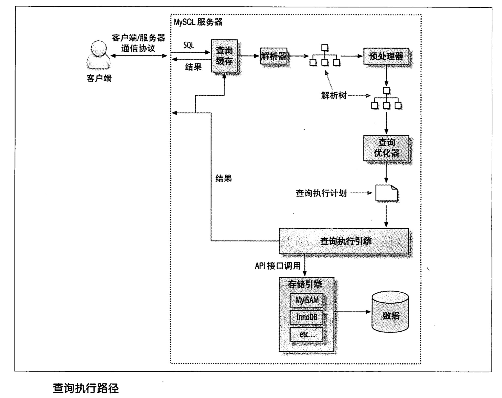
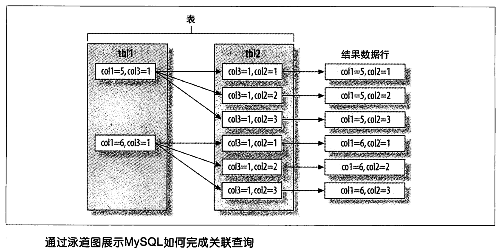

== 查询性能优化
include::_attributes.adoc[]

查询优化、索引优化、库表结构优化需要齐头并进，一个不落。

[[query-slow-query]]
=== 为什么查询速度会慢？

真正重要的是响应时间。

查询的生命周期大致可以按照顺序来看：从客户端，到服务器，然后在服务器上进行解析，生成执行计划，执行，并返回结果给客户端。在完成这些任务的时候，查询需要在不同的地方花费时间，包括网络，CPU 计算，生成统计信息和执行计划、锁等待（互斥等待）等操作，尤其是向地城存储引擎检索数据的调用，这些调用需要在内存操作、CPU 操作和内存不足时导致的 I/O 操作上消耗时间。

了解查询的生命周期、清楚查询的时间消耗情况对于优化查询有很大的意义。

[[query-optimize-data-access]]
=== 慢查询基础：优化数据访问

查询性能低下最基本的原因是访问的数据太多。

对于低效的查询，下面两步分析总是有效的：

. 确认应用程序是否在检索大量超过需要的数据。访问了太多的行，有时也可能访问太多的列。
. 确认 MySQL 服务器层是否在分析大量超过需要的数据行。

查询大量不需要的数据的典型案例：

. 查询不需要的记录
** 最简单有效的解决方法就是在这样的查询后面加上 `LIMIT`。
. 多表关联时返回全部列
. 总是取出全部列
** 每次看到 `SELECT *` 时都需要用怀疑的眼光审视，是不是真的需要返回全部的列！
. 重复查询相同的数据

最简单的衡量查询开销的三个指标如下：

* 响应时间
* 扫描的行数
* 返回的行数

这三个指标都会记录到 MySQL 的慢日志中，所以检查慢日志记录是找出扫描行数过多的查询的好办法。

.查看 MySQL 慢日志配置
[{sql_source_attr}]
----
SHOW GLOBAL VARIABLES LIKE '%slow%';
----

TIP: 可以写一个脚本来分析 MySQL 的日志，进而找出比较慢的查询。

响应时间::
响应时间只是表面上的一个值；但，响应时间仍然是最重要的指标。
+
响应时间是两部分之和：服务时间和排队时间。
+
服务时间::: 指数据库处理这个查询真正花了多长时间。
排队时间::: 指服务器因为等待某些资源而没有真正执行查询的时间--可能是等 I/O 操作完成，也可能是等待行锁等待。
+
一般最常见和重要的等待是 I/O 和锁等待。

https://book.douban.com/subject/26419771/[数据库索引设计与优化^] 一书讲述了一种估算查询的响应时间方法：快速上限估计。概括地说，了解这个查询需要哪些索引以及它的执行计划是什么，然后计算大概需要多少个顺序和随机 I/O，再用其乘以在具体硬件条件下一次 I/O 的消耗时间。最后把这些消耗都加起来，就可以获得一个大概参考值来判断当前响应时间是不是一个合理的值。

[quote, Tapio Lahdenmaki & Michael Leach , '数据库索引设计与优化']
____
**快速上限评估算法（QUBE）**

比较值::
LRT = TR * 10mx + TS * 0.01ms

绝对值::
LRT = TR * 10mx + TS * 0.01ms + F * 0.1ms

* LRT = 本地相应时间
* TR  = 随机访问的数量
* TS  = 顺序访问的数量
* F   = 有效 Fetch 的数量
____

扫描的行数和返回的行数::
并不是所有的行的访问代价是相同的。较短的行的访问速度更快，内存中的行也比磁盘中的行的访问速度要快得多。
+
理想情况下扫描的行数和返回的行数应该是相同的。扫描的行数对返回的行数比率通常很小，一般在 1:1 和 10:1 之间。

扫描的行数和访问类型::
在评估查询开销的时候，需要考虑一下从表中找到某一行数据的成本。
+
在 `EXPLAIN` 语句中的 `type` 列反应了访问类型。访问类型有很多种，从全表扫描到索引扫描、范围扫描、唯一索引查询、常数引用等。

如果查询没有办法找到合适的访问类型，那么解决的最好办法通常就是增加一个合适的索引。索引让 MySQL 以最高效、扫描行数最少的方式找到需要的记录。

[{sql_source_attr}]
----
USE sakila;

EXPLAIN
SELECT *
FROM film_actor
WHERE film_id = 1;

mysql> EXPLAIN SELECT * FROM film_actor WHERE film_id = 1 \G -- <1>
*************************** 1. row ***************************
           id: 1
  select_type: SIMPLE
        table: film_actor
   partitions: NULL
         type: ref
possible_keys: idx_fk_film_id
          key: idx_fk_film_id
      key_len: 2
          ref: const
         rows: 10
     filtered: 100.00
        Extra: NULL
1 row in set, 1 warning (0.00 sec)

ALTER TABLE film_actor
  DROP FOREIGN KEY fk_film_actor_film;

ALTER TABLE film_actor
  DROP KEY idx_fk_film_id;

EXPLAIN
SELECT *
FROM film_actor
WHERE film_id = 1;

mysql> EXPLAIN SELECT * FROM film_actor WHERE film_id = 1 \G -- <2>
*************************** 1. row ***************************
           id: 1
  select_type: SIMPLE
        table: film_actor
   partitions: NULL
         type: ALL
possible_keys: NULL
          key: NULL
      key_len: NULL
          ref: NULL
         rows: 5462
     filtered: 10.00
        Extra: Using where
1 row in set, 1 warning (0.00 sec)
----
<1> 从下面的结果也能看出，MySQL 在索引 idx_fk_film_id 上使用了 `ref` 访问类型来执行 SQL。
<2> 删除索引后，访问类型变成了一个全表扫描（ `ALL` ），现在 MySQL 预估需要扫描 5073 条记录来完成这个查询。 `Using where` 表示 MySQL 将通过 `WHERE` 条件来筛选存储引擎返回的记录。

一般 MySQL 能够使用如下三种方式应用 `WHERE` 条件，从好到坏以此为：

* 在索引中使用 `WHERE` 条件来过滤不匹配的记录。这是在存储引擎层完成的。
* 使用索引覆盖扫描（在 `Extra` 列中出现了 `Using index`）来返回记录，直接从索引中过滤掉不需要的记录并返回命中的结果。这是在 MySQL 服务器层完成的，但无须再回表查询记录。
* 从数据表中返回数据，然后过滤掉不满足条件的记录（在 `Extra` 列中出现 `Using Where`）。这在 MySQL 服务器层完成，MySQL 需要先从数据表读出记录然后过滤。

好的索引可以让查询使用合适的访问类型，尽可能地值扫描需要的数据行。但也不是说增加索引就能让扫描的行数等于返回的行数。例如 `COUNT(*)` 查询。

不幸的是，MySQL 不会告诉我们生成结果实际上需要扫描多少行数据，而只会告诉我们生成结果时一共扫描了多少行数据。扫描的行数中的大部分都很可能是被 `WHERE` 条件过滤掉的，对最终的结果集并没有贡献。理解一个查询需要扫描多少行和实际需要使用的行数需要先去理解这个查询背后的逻辑和思想。

如果发现查询需要扫描大量的数据但只返回少数的行，那么通常可以尝试下面的技巧去优化它：

* 使用索引覆盖扫描，把所有需要用到的列都放到索引中，这样存储引擎无须回表获取对应行就可以返回结果了。
* 改变库表结构。例如使用单独的汇总表。
* 重写这个复杂的查询，让 MySQL 优化器能够以更优化的方式执行这个查询。

[[query-refactor-query]]
=== 重构查询的方式

在优化有问题的查询时，目标应该是找到一个更优的方法获取实际需要的结果--而不一定总是需要从 MySQL 获取一模一样的结果集。

==== 一个复杂查询还是多个简单查询

设计查询的时候一个需要考虑的重要问题是，是否需要将一个复杂的查询分成多个简单的查询。

MySQL 从设计上让连接和断开连接都 很轻量级，在返回一个小的查询结果方面很高效。

MySQL 内部每秒能够扫描内存中上百万行数据。

在应用设计的时候，如果一个查询能够胜任时还写成多个独立查询是不明智的。

==== 切分查询

有时候对于一个大查询我们需要“分而治之”，将大查询切分成小查询，每个查询功能完全一样，只完成一小部分，每次只返回一小部分查询结果。例如删除旧的数据。

TIP: 这个原则不仅仅适用于数据库，在很多地方都适用。

==== 分解关联查询

可以对每一个表进行一次单表查询，然后将结果在应用程序中进行关联。

用分解关联查询的方式重构查询有如下的优势：

* 让缓存的效率更高。
* 将查询分解后，执行单个查询可以减少锁的竞争。
* 在应用层做关联，可以更容易对数据库进行拆分，更容易做到高性能和可扩展。
* 查询本身效率也可能会有所提升。
* 可以减少冗余记录的查询。
* 这样做相当于在应用中实现了哈希关联，而不是使用 MySQL 的嵌套循环关联。某些场景哈希关联的效率要高很多。

[[query-execution-basis]]
=== 查询执行的基础

当希望 MySQL 能够以更高的性能运行查询时，最好的办法就是弄清楚 MySQL 是如何优化和执行查询的。

当我们向 MySQL 发送一个请求的时候， MySQL 执行如下操作：

. 客户端发送一条查询给服务器。
. 服务器先检查查询缓存，如果命中了缓存，则立刻返回存储在缓存中的结果。否则进入下一阶段。
. 服务器进行 SQL 解析、预处理，再由优化器生成对应的执行计划。
. MySQL 根据优化器生成的执行计划，调用存储引擎的 API 来执行查询。
. 将结果返回给客户端。

==== MySQL 客户端/服务器通信协议

一般来说，不需要去理解 MySQL 通信协议的内部实现细节，只需要大致理解通信协议是如何工作的。MySQL 客户端和服务器之间的通信心意是“半双工”的，这意味着，在任何一个时刻，要么是由服务器向客户端发送数据，要么是由客户端向服务器发送数据，这两个动作不能同时发生。所以，我们无法也无须将一个消息切分成小块独立来发送。

通信简单，也有很多限制。一个明显的限制是，这意味着没法进行流量控制。一旦一段开始发送消息，另一段要接收完整个消息才能响应它。

客户端用一个独立的数据包将查询传给服务器。

相反的，一般服务器响应给用户的数据通常很多，由多个数据包组成。当服务器开始响应客户端请求时，客户端必须完整地接收整个返回结果，而不能简单地只取前面几条结果，然后让服务器停止发送数据。这也是在必要的时候一定要在查询中加上 `LIMIT` 限制的原因。

当客户端从服务器取数据时，看起来是一个拉数据的过程，但实际上是 MySQL 在向客户端推送数据的过程。客户端没法让服务器停下来。

多数连接 MySQL 的库函数都可以获得全部结果集并缓存到内存里，还可以逐行获取需要的数据。默认一般是获得全部结果集并缓存到内存中。

当使用多数连接 MySQL 的库函数从 MySQL 获取数据时，其结果看起来都像是从 MySQL 服务器获取数据，而实际上都是从这个库函数的缓存获取数据。

NOTE: 这里的意思是，处理 `ResultSet` 时，数据已经从 MySQL 服务器上读取过来数据，然后直接从 `ResultSet` 中取数据。

查询状态::
对于一个 MySQL 连接，或者说一个线程，任何时刻都有一个状态，该状态表示了 MySQL 当前正在做什么。有很多方式查看当前的状态，最简单的是使用 `SHOW FULL PROCESSLIST` 命令。
Sleep::: 线程正在等待客户端发送新的请求。

Query::: 线程正在执行查询或者正在将结果发送给客户端。

Locked::: 在 MySQL 服务器层，该线程正在等待表锁。在存储引擎级别实现的锁，例如 InnoDB 的行锁，并不会体现在线程状态中。

Analyzing and statistics::: 线程正在收集存储引擎的统计信息，并生成查询的执行计划。

Copying to tmp table [on disk]::: 线程正在执行查询，并且将结果集都复制到一个临时表中，这种状态一般要么是在做 `GROUP BY` 操作，要么是文件排序操作，或者是 `UNION` 操作。如果这个状态后面还有 `on disk` 标记，那表示 MySQL 正在将一个内存临时表放到磁盘上。

Sorting result::: 线程正在对结果集进行排序。

Sending data::: 这表示多种情况：线程可能在多个状态之间传送数据，或者在生成结果集，或者在向客户端返回数据。

==== 查询缓存

在解析一个查询语句之前，如果查询缓存是打开的，那么 MySQL 会优先检查这个查询是否命中查询缓存中的数据。检查是通过对大小写敏感的哈希查找实现的。不匹配则进行下一阶段处理。

命中缓存，那么在返回结果前 MySQL 会检查一次用户权限。如果没有问题，则直接从缓存中拿到结果返回给客户端。这种情况下，查询不会被解析，不用生成执行计划，不会执行。

==== 查询优化处理

查询的生命周期的下一步是将一个 SQL 转换成一个执行计划，MySQL 再按照这个执行计划和存储引擎进行交互。这包含多个子阶段： 解析 SQL、预处理、优化 SQL 执行计划。

===== 语法解析器和预处理

首先，MySQL 通过关键字将 SQL 语句进行解析，并生成一课对应的“解析树”。MySQL 解析器将使用 MySQL 语法规则验证和解析查询。

预处理器则根据一些 MySQL 规则进一步检查解析树是否合法。

下一步预处理器会验证权限。通常很快，除非有非常多的权限配置。

===== 查询优化器

一条查询可以有很多种执行方式，最后都返回相同的结果。优化器的作用就是找到这其中最好的执行计划。

MySQL 使用基于成本的优化器，它将尝试预测一个查询使用某种执行计划时的成本，并选择其中成本最小的一个。可以通过查询当前会话的 `Last_query_cost` 的值来得知 MySQL 计算的当前查询的成本。

[{sql_source_attr}]
----
USE sakila;

SELECT SQL_NO_CACHE count(*)
FROM film_actor;

SHOW STATUS LIKE 'Last_query_cost'; -- <1>
----
<1> 在不同机器上，结果可能不一样。

这是根据一系列的统计信息计算得来的：每个表或者索引的页面个数、索引的基数（索引中不同值的数量）、索引和数据行的长度、索引分布情况。

优化器在评估成本的时候并不考虑任何层面的缓存，它假设读取任何数据都需要一次磁盘 I/O。

导致 MySQL 优化器选择错误的执行计划的原因：

* 统计信息不准确。 MySQL 依赖存储引擎提供的统计信息来评估成本，但是有的存储引擎提供的信息是准确的，有的偏差可能非常大。
* 执行计划中的成本估算不等同于实际执行的成本。所以即使统计信息精确，优化器给出的执行计划也可能不是最优的。
* MySQL 的最优可能和你想的最优不一样。由此可见，根据执行成本选择执行计划并不是完美的模型。
* MySQL 从不考虑其他并发执行的查询，这可能会影响到当前查询的速度。
* MySQL 也并不是任何时候都是基于成本的优化。例如全文检索。
* MySQL 不会考虑不受其控制的操作的成本。
* 优化器有时无法去估算所有可能的执行计划。

MySQL 的查询优化器是一个非常复杂的部件，它使用了很多优化策略来生成一个最优的执行计划。优化策略可以简单地分为两种，一种是静态优化，一种是动态优化。静态优化可以直接对解析树进行分析，并完成优化。静态优化不依赖于特别的数值。静态优化在第一次完成后就一直有效，即使使用不同的参数值重复执行查询也不会发生变化。可以认为这是一种“编译时优化”。

动态优化则和查询的上下文有关，也可能和很多其他因素有关，需要在每次查询时都重新评估，可以认为是“运行时优化”。有时甚至在查询的执行过程中也会重新优化。

MySQL 能够处理的优化类型：

重新定义关联表的顺序::
数据表的关联并不总是安装在查询中指定的顺序进行。决定关联的顺序是优化器很重要的一部分功能。
将外连接转化成内连接::
并不是所有的 `OUTER JOIN` 语句都必须以外连接的方式执行。
使用等价变换规则::
MySQL 可以使用一些等价变换来简化并规范表达式。可以科比能够一些比较，移除一些恒成立和一些恒不成立的判断等等。
优化 `COUNT()`、`MIN()` 和 `MAX()`::
索引和列是否可为空通常可以帮助 MySQL 优化这类表达式。例如：从 B-Tree 索引中取最大值或者最小值；没有任何 `WHERE` 条件的 `COUNT(*)` 查询。
预估并转化为常数表达式::
当 MySQL 检测到一个表达式可以转化为常数的时候，就会一直把该表达式作为常数进行优化处理。
+
让人惊讶的是，在优化阶段，有时候甚至一个查询也能够转化为一个常数。例如：在索引列上执行 `MIN()`；甚至主键或者唯一键查找语句。
+
[{sql_source_attr}]
----
USE sakila;

EXPLAIN
SELECT
  f.film_id,
  fa.actor_id
FROM film f
  INNER JOIN film_actor fa USING (film_id)
WHERE f.film_id = 1 \G

*************************** 1. row ***************************
           id: 1
  select_type: SIMPLE
        table: f
   partitions: NULL
         type: const
possible_keys: PRIMARY
          key: PRIMARY
      key_len: 2
          ref: const
         rows: 1
     filtered: 100.00
        Extra: Using index
*************************** 2. row ***************************
           id: 1
  select_type: SIMPLE
        table: fa
   partitions: NULL
         type: ref
possible_keys: idx_fk_film_id
          key: idx_fk_film_id
      key_len: 2
          ref: const
         rows: 10
     filtered: 100.00
        Extra: Using index
----
+
MySQL 分两步来执行查询。第一步从 `film` 表找到需要的行。因为在 `film_id` 字段上有主键索引，所以 MySQL 优化器知道这只会返回一行数据，优化器在生成执行计划的时候，就已经通过索引信息知道将返回多少行数据。因为优化器已经明确知道有多少个值（ `WHERE` 条件中的值）需要做索引查询，所以这里的表访问类型是 `const`。 +
第二步，MySQL 将第一步中返回的 `film_id` 列当做一个已知取值的列来处理。因为优化器清楚再第一步执行完成后，该值就会是明确的了。注意到正如第一步中一样，使用 `film_actor` 字段对表的访问类型也是 `const`。P212
+
另一种会看到常数条件的情况是通过等式将常数值从一个表传给另一个表，这可以通过 `WHERE`、`USING` 或者 `ON` 语句来限制某列值为常数。
覆盖索引扫描::
当索引中的列包含所有查询中需要使用的列的时候， MySQL 就可以使用索引返回需要的数据，而无须查询对应的数据行。
子查询优化::
MySQL 在某些情况下可以将子查询转换成一种效率更高的形式，从而减少多个查询多次对数据进行访问。
提前终止查询::
在发现已经满足查询需求的时候，MySQL 总是能够立刻终止查询。例如：`LIMIT` 子句；再例如，发现一个不成立的条件。
+
[{sql_source_attr}]
----
USE sakila;

EXPLAIN
SELECT film_id
FROM film
WHERE film_id = -1 \G
*************************** 1. row ***************************
           id: 1
  select_type: SIMPLE
        table: NULL
   partitions: NULL
         type: NULL
possible_keys: NULL
          key: NULL
      key_len: NULL
          ref: NULL
         rows: NULL
     filtered: NULL
        Extra: no matching row in const table
----
+
从这个例子看到，查询在优化阶段就已经终止。
等值传播::
如果两个列的值通过等式关联，那么 MySQL 能够把其中一个列的 `WHERE` 条件传递到另一列上。
列表 `IN()` 的比较::
在很多数据库系统中，`IN()` 完全等同于多个 `OR` 条件的子句，因为这两者是完全等价的。而 MySQL 将 `IN()` 列表中的数据先进行排序，然后通过二分查找的方式来确定列表中的值是否满足条件，这是 O(log __n__) 复杂度；转化成 `OR` 查询则为 O(__n__)。

*不要自以为比优化器更聪明！*

===== 数据和索引的统计信息

不同的存储引擎可能会存储不同的统计信息（也可以按照不同的格式存储统计信息）。

MySQL 查询优化器在生成查询的执行计划时，需要向存储引擎获取相应的统计信息。存储引擎则提供给优化器对应的统计信息，包括：每个表或者索引有多少个页面、每个表的每个索引的基数是多少、数据行和索引长度、索引的分布信息等等

===== MySQL 如何执行关联查询

MySQL 认为任何一个查询都是一次“关联” -- 并不仅仅是一个查询需要到两个表匹配才叫关联，所以在 MySQL 中，每一个查询，每一个片段（包括子查询，甚至基于单表的 `SELECT`）都可能使关联。

对于 `UNION` 查询，MySQL 先将一系列的单个查询结果放到一个临时表中，然后再重新读出临时表数据来完成 `UNION` 查询。

MySQL 关联执行的策略：MySQL 对任何关联都执行嵌套循环关联操作，即 MySQL 先在一个表中循环取出单条数据，然后再嵌套循环到下一个表中寻找匹配的行，依次下去，知道找到所有表中匹配的行位置。然后根据各个表匹配的行，返回查询中需要的各个列。MySQL 会尝试在最后一个关联表中找到所有匹配的行，如果最后一个关联表无法找到更多的行以后，MySQL 返回到上一层次关联表，看是否能够找到更多的匹配记录，以此类推迭代执行。可以使用如下代码来解释：

[{sql_source_attr}]
----
-- 内关联查询 ----------------------------------------------------
SELECT
  tbl1.col1,
  tbl2.col2
FROM tbl1
  INNER JOIN tbl2 USING (col3)
WHERE tbl1.col1 IN (5, 6);

-- 用伪代码来解释 MySQL 关联执行的策略则是如下：
outer_iter = iteratro over tbl1 WHERE col1 IN (5, 6)
outer_row = outer_iter.next
while outer_row
    inner_iter = iteratro over tbl2 WHERE col3 = outer_row.col3
    inner_row  = inner_iter.next
    while inner_row
        output [outer_row.col1, inner_row.col2]
        inner_row = inner_iter.next
    end
    outer_row = outer_iter.next
end

-- 左外关联查询 --------------------------------------------------

SELECT
  tbl1.col1,
  tbl2.col2
FROM tbl1
  LEFT OUTER JOIN tbl2 USING (col3)
WHERE tbl1.col1 IN (5, 6);

-- 用伪代码来解释 MySQL 关联执行的策略则是如下：
outer_iter = iteratro over tbl1 WHERE col1 IN (5, 6)
outer_row = outer_iter.next
while outer_row
    inner_iter = iteratro over tbl2 WHERE col3 = outer_row.col3
    inner_row  = inner_iter.next
    if inner_row
        while inner_row
            output [outer_row.col1, inner_row.col2]
            inner_row = inner_iter.next
        end
    else
        output [outer_row.col1, NULL]
    end
    outer_row = outer_iter.next
end
----

可视化查询执行计划的方法是根据优化器执行的路径绘制出对应的“泳道图”。

从本质上来说，MySQL 对所有的类型的查询都以同样的方式运行。例如：子查询先放到一个临时表；`UNION` 也用类似的临时表。

TIP: 在 MySQL 5.6 和 MariaDB 中有了重大改变，这两个版本都引入了更加复杂的执行计划。

===== 执行计划

MySQL 生成查询的一棵指令树，然后通过存储引擎执行完成这颗指令树并返回结果。最终的执行计划包含了重构查询的全部信息。

如果读某个查询执行 `EXPLAIN EXTENDED` 后，再执行 `SHOW WARNINGS`，就可以看到重构出的查询。

===== 关联查询优化器

MySQL 优化器最重要的一部分就是关联查询优化，它决定了多个表关联时的顺序。关联查询优化器通过评估不同关联顺序时的成本来选择一个代价最小的关联顺序。

[{sql_source_attr}]
----
USE sakila;

EXPLAIN
SELECT
  film.film_id,
  film.title,
  film.release_year,
  actor.actor_id,
  actor.first_name,
  actor.last_name
FROM film
  INNER JOIN film_actor USING (film_id)
  INNER JOIN actor USING (actor_id) \G

*************************** 1. row ***************************
           id: 1
  select_type: SIMPLE
        table: actor
   partitions: NULL
         type: ALL
possible_keys: PRIMARY
          key: NULL
      key_len: NULL
          ref: NULL
         rows: 200
     filtered: 100.00
        Extra: NULL
*************************** 2. row ***************************
           id: 1
  select_type: SIMPLE
        table: film_actor
   partitions: NULL
         type: ref
possible_keys: PRIMARY,idx_fk_film_id
          key: PRIMARY
      key_len: 2
          ref: sakila.actor.actor_id
         rows: 27
     filtered: 100.00
        Extra: Using index
*************************** 3. row ***************************
           id: 1
  select_type: SIMPLE
        table: film
   partitions: NULL
         type: eq_ref
possible_keys: PRIMARY
          key: PRIMARY
      key_len: 2
          ref: sakila.film_actor.film_id
         rows: 1
     filtered: 100.00
        Extra: NULL
3 rows in set, 1 warning (0.00 sec)
----

从这个执行计划就能能看出这个查询是从 `actor` 开始查询的。对比一下：

[{sql_source_attr}]
----
USE sakila;

EXPLAIN
SELECT STRAIGHT_JOIN
  film.film_id,
  film.title,
  film.release_year,
  actor.actor_id,
  actor.first_name,
  actor.last_name
FROM film
  INNER JOIN film_actor USING (film_id)
  INNER JOIN actor USING (actor_id) \G

*************************** 1. row ***************************
           id: 1
  select_type: SIMPLE
        table: film
   partitions: NULL
         type: ALL
possible_keys: PRIMARY
          key: NULL
      key_len: NULL
          ref: NULL
         rows: 1000
     filtered: 100.00
        Extra: NULL
*************************** 2. row ***************************
           id: 1
  select_type: SIMPLE
        table: film_actor
   partitions: NULL
         type: ref
possible_keys: PRIMARY,idx_fk_film_id
          key: idx_fk_film_id
      key_len: 2
          ref: sakila.film.film_id
         rows: 5
     filtered: 100.00
        Extra: Using index
*************************** 3. row ***************************
           id: 1
  select_type: SIMPLE
        table: actor
   partitions: NULL
         type: eq_ref
possible_keys: PRIMARY
          key: PRIMARY
      key_len: 2
          ref: sakila.film_actor.actor_id
         rows: 1
     filtered: 100.00
        Extra: NULL
----

如果优化器给出的并不是最优的关联顺序，可以使用 `STRAIGHT_JOIN` 关键字重新查询，让优化器按照你认为的最优的关联顺序执行。绝大多数时候，优化器做出的选择都比普通人的判断更准确。

关联优化器会尝试在所有的关联顺序中选择一个成本最小的来生成执行计划树。

糟糕的是，如果有超过 n 个表关联，那么需要检查 n 的阶乘种关联关系，称之为所有可能的执行计划的 “搜索空间”，搜索空间的增长非常快。当搜索空间非常大的时候，优化器不可能逐一评估每一种关联顺序的成本，优化器选择使用“贪婪”搜索的方式查找“最优”的关联顺序。

===== 排序优化

无论如何排序都是一个成本很高的操作，所以从性能角度考虑，应尽可能避免排序或者尽可能避免对大量数据进行排序。

如果需要排序的数量小于“排序缓冲区”，MySQL 使用内存进行“快速排序”操作。如果内存不够排序，那么 MySQL 会先将数据分块，对每个独立的块使用“快速排序”进行排序，并将各个块的排序结果存放在磁盘上，然后将各个排好序的块进行合并，最后返回排序结果。

MySQL 有如下两种排序算法：

两次传输排序（旧版本使用）::
读取行指针和需要排序的字段，对其进行排序，然后再根据排序结果读取所需要的数据行。
+
需要两次数据传输，即需要从数据表中读取两次数据，第二次读取数据的时候，因为是读取排序列进行排序后的所有记录，会产生大量的随机 I/O。
+
优点：在排序的时候存储尽可能少的数据，让“排序缓冲区”中可能容纳尽可能多的行数进行排序。
单次传输排序（新版本使用）::
先读取查询所需要的所有列，然后再根据给定列进行排序，最后直接返回排序结果。
+
在 MySQL 4.1 和后续更新的版本才引入。
+
优点：不需要读取两次数据，对于 I/O 密集型的应用，效率高很多，只需一次顺序 I/O 读取所有的数据，无须任何的随机 I/O。
+
缺点：如果返回的列非常多、非常大，会额外占用大量的空间。

NOTE: 可以通过调整 `max_length_for_sort_data` 来影响 MySQL 排序算法的选择。

TIP: MySQL 在进行文件排序的时候需要使用的临时存储空间可能会比想象的要大得多。

如果 `ORDER BY` 子句中的所有列都来自关联的第一个表，那么 MySQL 在关联处理第一个表的时候就进行文件排序。如果是这样，那么在 MySQL 的 `EXPLAIN` 结果中可以看到 `Extra` 字段会有 `Using filesort`。除此之外的所有情况，MySQL 都会先将管理的结果存放到一个临时表中，然后在所有的关联都结束后，再进行文件排序。这时，在 MySQL 的 `EXPLAIN` 结果的 `Extra` 字段可以看到 `Using temporary; Using filesort`。`LIMIT` 会在排序后应用。

MySQL 5.6 当还需要返回部分查询结果时，不再对所有结果进行排序。

TIP: 从这句话中也可以看出，如果可以，尽量使用一张表中的字段。

==== 查询执行引擎

查询执行阶段不是那么复杂：MySQL 只是简单地根据执行计划给出的指令逐步执行。

存储引擎接口有着非常丰富的功能，但底层接口却只有几十个，这些接口像“搭积木”一样能够完成查询的大部分操作。

==== 返回结果给客户端

查询执行的最后一个阶段是将结果返回给客户端。

如果查询可以被缓存，那么 MySQL 在这个阶段也会将结果存放到查询缓存中。

MySQL 将结果集返回客户端是一个增量、逐步返回的过程。

[[query-optimizer-limitations]]
=== MySQL 查询优化器的局限性

MySQL 的万能“嵌套循环”并不是对每种查询都是最优的。MySQL 查询优化器只对少部分查询不适用，往往可以通过改写查询让 MySQL 高效地完成工作。

==== 关联子查询

MySQL 的子查询实现得非常糟糕。最糟糕的一类查询是 `WHERE` 条件中包含 `IN()` 的子查询语句。

[{sql_source_attr}]
----
USE sakila;

-- 原始写法
SELECT *
FROM film
WHERE film_id IN (
  SELECT film_id
  FROM film_actor
  WHERE actor_id = 1);

-- 改进后的写法
SELECT film.*
FROM film
  INNER JOIN film_actor USING (film_id)
WHERE actor_id = 1;

-- 书上提到的第二种写法，但是书上前后矛盾，
-- 查看执行计划也发现，这种写法有问题。
SELECT *
FROM film
WHERE EXISTS(
    SELECT *
    FROM film_actor
    WHERE actor_id = 1
          AND film_actor.film_id = film.film_id);
----

TIP: 在 MySQL 5.7 中，上面第一种 SQL 存在的问题已经得到解决。可以和第二种有同样的表现。

===== 如何用好关联子查询

并不是所有关联子查询的性能都会很差。先测试，然后做出自己的判断。很多时候，关联子查询是一种非常合理、自然，甚至是性能最好的写法。

[{sql_source_attr}]
----
USE sakila;

EXPLAIN
SELECT
  film_id,
  language_id
FROM film
WHERE NOT EXISTS(
    SELECT *
    FROM film_actor
    WHERE film_actor.film_id = film.film_id);

*************************** 1. row ***************************
           id: 1
  select_type: PRIMARY
        table: film
   partitions: NULL
         type: index
possible_keys: NULL
          key: idx_fk_language_id
      key_len: 1
          ref: NULL
         rows: 1000
     filtered: 100.00
        Extra: Using where; Using index -- <2>
*************************** 2. row ***************************
           id: 2
  select_type: DEPENDENT SUBQUERY  -- <1>
        table: film_actor
   partitions: NULL
         type: ref
possible_keys: idx_fk_film_id
          key: idx_fk_film_id
      key_len: 2
          ref: sakila.film.film_id
         rows: 5
     filtered: 100.00
        Extra: Using index  -- <3>

-- 使用左外链接“优化”后的 SQL
EXPLAIN
SELECT
  film.film_id,
  film.language_id
FROM film
  LEFT OUTER JOIN film_actor USING (film_id)
WHERE film_actor.film_id IS NULL \G

*************************** 1. row ***************************
           id: 1
  select_type: SIMPLE
        table: film
   partitions: NULL
         type: index
possible_keys: NULL
          key: idx_fk_language_id
      key_len: 1
          ref: NULL
         rows: 1000
     filtered: 100.00
        Extra: Using index -- <2>
*************************** 2. row ***************************
           id: 1
  select_type: SIMPLE  -- <1>
        table: film_actor
   partitions: NULL
         type: ref
possible_keys: idx_fk_film_id
          key: idx_fk_film_id
      key_len: 2
          ref: sakila.film.film_id
         rows: 5
     filtered: 100.00
        Extra: Using where; Not exists; Using index -- <3>
----
<1> 表 film_actor 的访问类型一个是 `DEPENDENT SUBQUERY`，另外一个是 `SIMPLE`。这是由于语句的写法不同导致的，一个是普通查询，一个是子查询。对于底层存储引擎接口来说，没有任何不同。
<2> 对于 film 表，第二个查询的 `Extra` 中没有 `Using where`，但不重要，第二个查询的 `USING` 子句和第一个查询的 `WHERE` 子句实际上是完全一样的。
<3> 第二个表 film_actor 的执行计划的 `Extra` 列有 `Not exists`。这是提前终止算法（early-termination algorithm），MySQL 通过使用 `Not exists` 优化来避免在表 film_actor 的索引中读取额外的行。这完全等效于直接编写 `NOT EXISTS` 子查询。

综上，从理论上来讲，MySQL 将使用完全相同的执行计划来完成这个查询。

*再次强调：应该用测试来验证对子查询的执行计划和响应时间的假设！*

==== `UNION` 的限制

MySQL 无法将限制条件从外层“下推”到内层。例如，无法将 `LIMIT` “下推”到 `UNION` 的各个子句。

==== 索引合并优化

在 MySQL 5.0 和更新的版本中，当 `WHERE` 子句中包含多个复杂条件的时候，MySQL 能够访问单个表的多个索引以合并和交叉过滤的方式来定位需要查找的行。

==== 等值传递

某些时候，等值传递会带来一些意想不到的额外消耗。例如，一个非常大的 `IN()` 列表。

==== 并行执行

MySQL 无法利用多核特性来并行执行查询。

==== 哈希关联

MariaDB 已经实现了真正的哈希关联。

==== 松散索引扫描

MySQL 并不支持松散索引扫描。通常，MySQL 的索引扫描需要先定义一个起点和终点，即使需要的数据只是这段索引中很少数的几个，MySQL 仍需要扫描这段索引中每一个条目。

例如：所以字段是（a, b），查询 b 字段区间值。可以逐个 a 去定位指点 b，这样效果就会很好。

MySQL 5.0 之后的版本，在某些特殊的场景下是可以使用松散索引扫描的，例如，在一个分组查询中需要找到分组的最大值和最小值：

[{sql_source_attr}]
----
EXPLAIN
SELECT
  actor_id,
  max(film_id)
FROM film_actor
GROUP BY actor_id \G

*************************** 1. row ***************************
           id: 1
  select_type: SIMPLE
        table: film_actor
   partitions: NULL
         type: range
possible_keys: PRIMARY,idx_fk_film_id
          key: PRIMARY
      key_len: 2
          ref: NULL
         rows: 201
     filtered: 100.00
        Extra: Using index for group-by
----

在 `EXPLAIN` 的 `Extra` 字段显示 “Using index for group-by”，表示这里将使用松散索引扫描。如果 MySQL 能写上 “loose index probe”，相信会更好理解。

一个简单的绕过问题的办法就是给前面的列加上可能的常数值。

在 MySQL 5.6 之后的版本，关于松散索引扫描的一些限制会通过“索引条件下推（index condition pushdown）”的方式来解决。

==== 最大值和最小值优化

对于 `MIN()` 和 `MAX()` 查询，MySQL 的优化做得并不好。

[{sql_source_attr}]
----
SELECT MIN(actor_id)
FROM actor
WHERE first_name = 'PENELOPE';
----

`first_name` 字段没有索引，会做一次全表扫描。如能使用主键扫描，当 MySQL 读到第一个满足条件的记录的时候，就是我们需要的最小值了。可以通过查看 `SHOW STATUS` 的全表扫描计数器来验证这点。

一个曲线的优化方法是移除 `MIN()`，然后使用 `LIMIT` 来重写查询：

[{sql_source_attr}]
----
SELECT actor_id
FROM actor
USE INDEX (PRIMARY)
WHERE first_name = 'PENELOPE'
LIMIT 1;
----

这个 SQL 已经无法表达她的本意了。

一般我们通过 SQL 告诉服务器我们需要什么数据，由服务器来决定如何最优地获取数据。

有时候为了获得更高的性能，我们不得不放弃一些原则。

==== 在同一个表上查询和更新

MySQL 不允许对同一张表同时进行查询和更新。

[{sql_source_attr}]
----
-- 书上没有给表的定义，根据上下文 SQL 自行添加
DROP TABLE IF EXISTS tbl;
CREATE TABLE tbl (
  id   INTEGER AUTO_INCREMENT PRIMARY KEY,
  type TINYINT,
  cnt  INTEGER DEFAULT 0
);

UPDATE tbl AS outer_tbl
SET cnt = (
  SELECT count(*)
  FROM tbl AS inner_tbl
  WHERE inner_tbl.type = outer_tbl.type
);  -- <1>

UPDATE tbl
  INNER JOIN (
               SELECT
                 type,
                 count(*) AS cnt
               FROM tbl
               GROUP BY type
             ) AS der USING (type)
SET tbl.cnt = der.cnt; -- <2>
----
<1> 报错 “[HY000][1093] You can't specify target table 'outer_tbl' for update in FROM clause”
<2> 通过使用生成表的形式来绕过上面的限制。

[[query-optimizer-hint]]
=== 查询优化器的提示（hint）

如果对查询优化器选择的执行计划不满意，可以使用优化器提供的几个提示来控制最终的执行计划。

HIGH_PRIORITY 和 LOW_PRIORITY::
当多个语句同事访问某一个表的时候，哪些语句的优先级相对高些、哪些语句的优先级相对低些。
+
这两个提示只对使用表锁的存储引擎有效，千万不要在 InnoDB 或者其他有细粒度锁机制和并发控制的引擎中使用。
DELAYED::
只对 `INSERT` 和 `REPLACE` 有效。
+
MySQL 会将使用该提示的语句立即返回给客户端，并将插入的行数据放入到缓冲区，然后在表空闲时批量将数据写入。
+
并不是所有的存储引擎都支持；该提示会导致函数 `LAST_INSERT_ID()` 无法正常工作。
STRAIGHT_JOIN::
放置在 `SELECT` 语句的 `SELECT` 关键字之后：是让查询中所有的表按照在语句中出现的顺序进行关联；
+
放置在任何两个关联表的名字之间：固定其前后两个表的关联顺序。
SQL_SMALL_RESULT 和 SQL_BIG_RESULT::
只对 `SELECT` 语句有效。
+
告诉优化器对 `GROUP BY` 和 `DISTINCT` 查询如何使用临时表及排序。
+
`SQL_SMALL_RESULT` 告诉优化器结果集很小，可以将结果集放在内存中的索引临时表，以避免排序操作。 +
`SQL_BIG_RESULT` 告诉优化器结果集可能会非常大，建议使用磁盘临时表做排序操作。
SQL_BUFFER_RESULT::
告诉优化器将查询结果放入到一个临时表，然后尽可能快地释放表锁。使用服务端缓存无须在客户端上消耗太多内存，可以尽快释放对应的表锁。代价是，服务器端需要更多的内存。
SQL_CACHE 和 SQL_NO_CACHE::
告诉 MySQL 这个结果集释放应该缓存在查询缓存中。
SQL_CALC_FOUND_ROWS::
让 MySQL 返回的结果集包含更多的信息。查询中加上该提示 MySQL 会计算除去 `LIMIT` 子句后这个查询要返回的结果集的总数，而实际上只返回 `LIMIT` 要求的结果集。可以通过函数 `FOUND_ROW()` 获取这个值。
FOR UPDATE 和 LOCK IN SHARE MODE::
主要控制 `SELECT` 语句的锁机制，但只对实现了行级锁的存储引擎有效。该提示会对符合查询条件的数据行加锁。对 `INSERT...SELECT` 语句在 MySQL 5.0 和更新版本会默认给这些记录加上锁。
+
唯一内置的支持这两个提示的引擎就是 InnoDB。这两个提示会让某些优化无法正常使用，例如索引覆盖扫描。InnoDB 不能在不访问主键的情况下排他性地锁定行，因为行的版本信息保存在主键中。
USE INDEX、IGNORE INDEX 和 FORCE INDEX::
告诉优化器使用或者不使用哪些索引来查询记录。在 MySQL 5.1 和之后的版本可以通过新增选项 `FOR ORDER BY` 和 `FOR GROUP BY` 来指定是否对排序和分组有效。

在 MySQL 5.0 和更新版本中，新增了一些参数用来控制优化器的行为：

optimizer_search_depth::
控制优化器在穷举执行计划时的限度。如果查询长时间处于 “Statistics” 状态，那么可以考虑调低此参数。
optimizer_prune_level::
默认打开。让优化器根据需要扫描的行数来决定是否跳过某些执行计划。
optimizer_switch::
包含了一些开启/关闭优化器特性的标志位。

.MySQL 升级后的验证
****
在优化器面前耍一些“小聪明”是不好的。设置的“优化器提示”很可能会让新版的优化策略失效。

在 MySQL 5.6 中，优化器的改进也是近些年来最大的一次改进。

升级操作建议仔细检查各个细节，以防止一些边界情况影响你的应用程序。

使用 Percona Toolkit 中的 `pt-upgrade` 工具，就可以检查在新版中运行的 SQL 是否与老版本一样，返回相同的结果。
****

[[query-optimize-specific-queries]]
=== 优化特定类型的查询

==== 优化 `COUNT()` 查询

===== `COUNT()` 的作用

`COUNT()` 是一个特殊的函数，有两种非常不同的作用：可以统计某个列值的数量，也可以统计行数。在统计列值时要求是非空的（不统计 `NULL`）。

当 MySQL 确认括号内的表达式值不可能为空时，实际就是在统计行数。 `COUNT(*)` 不会扩展成所有的列；它会忽略所有的列而直接统计所有的行数。

一个常见错误是：在括号内指定了一个列却希望统计结果集的行数。如果统计结果集的行数，最好使用 `COUNT(*)` ，意义清晰，性能也很好。

===== 关于 MyISAM 的神话

一个容易产生的误解：MyISAM 的 `COUNT()` 函数总是非常快，不过这是有前提条件的，即只有没有任何 `WHERE` 条件的 `COUNT(*)` 才非常快。MySQL 利用存储引擎的特性直接获取这个值。

如果 MySQL 知道某个列 col 不可能为 `NULL` 值，那么 MySQL 内部会将 `COUNT(col)` 表达式转化为 `COUNT(*)`。

当统计带 `WHERE` 子句的结果集行数，可以是统计某个列值的数量时，MyISAM 的 `COUNT()` 和其他存储引擎没有任何不同。

===== 简单的优化

[{sql_source_attr}]
----
-- 书中没有建表语句，根据上下文 SQL 创建
DROP TABLE IF EXISTS city;
CREATE TABLE city (
  id   INTEGER AUTO_INCREMENT PRIMARY KEY,
  name VARCHAR(100) NOT NULL
) ENGINE = MyISAM;

-- 没有优化的 SQL，需要扫描大多数行
SELECT COUNT(*)
FROM city
WHERE id > 5;

-- 优化后的 SQL，只需要扫描少量的行
SELECT (SELECT COUNT(*)
        FROM city) - COUNT(*)
FROM city
WHERE id <= 5;
----

在同一个查询中统计同一列的不同值的数量，以减少查询的语句量。可以这样：

[{sql_source_attr}]
----
DROP TABLE IF EXISTS items;
CREATE TABLE items (
  id    INTEGER AUTO_INCREMENT PRIMARY KEY,
  color VARCHAR(50)
);

SELECT
  SUM(IF(color = 'blue', 1, 0)) AS blue,
  SUM(IF(color = 'red', 1, 0))  AS red
FROM items;

SELECT
  COUNT(color = 'blue' OR NULL) AS blue,
  COUNT(color = 'red' OR NULL)  AS red
FROM items;
----

===== 使用近似值

有时候某些业务场景并不要求完全精确的 `COUNT` 值，此时可以用近似值代替。`EXPLAIN` 出来的优化器估算的行数就是一个不错的近似值，执行 `EXPLAIN` 并不需要真正地去执行查询，所以成本很低。

很多时候，计算精确值的成本非常高，而计算近似值则非常简单。例如统计网站的当前活跃用户数。

===== 更复杂的优化

通常来说， `COUNT()` 都需要扫描大量的行才能获取精确的结果，因此很难优化。除了上面的方法，还可以使用索引覆盖扫描。

如果这还不够，就需要考虑修改应用的架构，可以增加汇总表，或者增加类似 Memcached 这样的外部缓存系统。很快发现陷入一个困境，“快速，精确和实现简单”，三者永远只能满足其二，必须舍掉其中之一。

==== 优化关联查询

* 确保 `ON` 或者 `USING` 子句的列上有索引。一般来说，除非有其他理由，否则只需要在关联顺序中的第二个表的相应列上创建索引。
* 确保任何的 `GROUP BY` 和 `ORDER BY` 中的表达式只涉及到一个表中的列，这样 MySQL 才有可能使用索引来优化这个过程。
* 当升级 MySQL 的时候需要注意：关联语法、运算符优先级等其他可能会发生变化的地方。

==== 优化子查询

子查询优化最重要的优化建议是尽可能使用关联查询代替，至少当前的 MySQL 版本需要这样。

使用 MySQL 5.6 或者更新的版本或者 MariaDB，则可以忽略这个建议。

==== 优化 `GROUP BY` 和 `DISTINCT`

它们都可以使用索引来优化，这也是最有效的优化办法。

在 MySQL 中，当无法使用索引的时候， `GROUP BY` 使用两种策略来完成：使用临时表或者文件排序来分组。

如果需要对关联查询做分组，并且是按照查找表中的某个列进行分组，那么通常采用查找表的标识列分组的效果会比其他列更高。例如：

[{sql_source_attr}]
----
-- 这个查询效率不会很好
SELECT
  actor.first_name,
  actor.last_name,
  COUNT(*)
FROM film_actor
  INNER JOIN actor USING (actor_id)
GROUP BY actor.first_name, actor.last_name;

-- 这个查询的效率更高
SELECT
  actor.first_name,
  actor.last_name,
  COUNT(*)
FROM film_actor
  INNER JOIN actor USING (actor_id)
GROUP BY film_actor.actor_id;
----

建议始终使用含义明确的语法。

如果密钥通过 `ORDER BY` 子句显式地指定拍序列，当查询使用 `GROUP BY` 子句的时候，结果集会自动按照分组的字段进行排序。如果不关心结果集的顺序，则可以使用 `ORDER BY NULL`，让 MySQL 不再进行文件排序。也可以在 `GROUP BY` 子句中直接使用 `DESC` 和 `ASC` 关键字，使分组的结果集按需要的方向排序。

===== 优化 `GROUP BY WITH ROLLUP`

分组查询的一个变种就是要求 MySQL 对返回的分组结果再做一次超级聚合。可以使用 `WITH ROLLUP` 子句来实现，但可能不够优化。

最好的办法是尽可能的将 `WITH ROLLUP` 功能转移到应用程序中处理。

==== 优化 `LIMIT` 分页

一个非常常见又令人头疼的问题就是，在偏移量非常大的时候，查询代价非常高。要优化这种查询，要么是在页面中限制分页的数量，要么是优化大偏移量的性能。

优化此类分页查询的一个最简单的办法就是尽可能使用索引覆盖扫描，而不是查询所有的列。然后根据需要做一次关联操作再返回所需要的列。对于偏移量很大的时候，这样做的效率会提升非常大。

[{sql_source_attr}]
----
-- 效率一般
SELECT
  film_id,
  description
FROM film
ORDER BY title
LIMIT 50, 5;

-- 延迟关联，大大提升查询效率
SELECT
  film_id,
  description
FROM film
  INNER JOIN (
       SELECT film_id
       FROM film
       ORDER BY title
       LIMIT 50, 5
     ) AS lim USING (film_id);
----

有时候也可以将 `LIMIT` 查询转换为已知位置的查询，让 MySQL 通过范围扫描获得到对应的结果。

`LIMIT` 和 `OFFSET` 的问题，其实是 `OFFSET` 的问题，它会导致 MySQL 扫描大量不需要的行然后在抛弃掉。如果可以使用书签记录上次数据的位置，那么下次就可以直接从该书签记录的位置开始扫描，这样就可以避免使用 `OFFSET`。

其他优化方法还包括使用预先计算的汇总表，或者关联到一个冗余表，冗余表值包含主键列和需要做排序的数据列。

==== 优化 `SQL_CALC_FOUND_ROWS`

分页的时候，另外一个常用的技巧是在 `LIMIT` 语句中加上 `SQL_CALC_FOUND_ROWS` 提示，这样就可以获得去掉 `LIMIT` 以后满足条件的行数，因此可以作为分页的总数。加上该提示，MySQL 都会扫描所有满足条件的行再抛弃不需要的行，代价非常高。

一个更好的设计是将具体的页数换成“下一页”按钮，这样只需要下一页的是否有数据，就决定是否显示“下一页”按钮。

另外一种做法是先获取并缓存较多的数据，然后每次分页都从这个缓存中获取。

有时候也可以考虑使用 `EXPLAIN` 的结果中的 `rows` 列的值作为结果集总数的近似值。当需要使用精确值时，再单独使用 `COUNT(*)` 来满足需求。

==== 优化 `UNION` 查询

MySQL 总是通过创建并填充临时表的方式来执行 `UNION` 查询。经常需要手动将 `WHERE`、`LIMIT`、`ORDER BY` 等子句下推到 `UNION` 的各个子查询中，以便优化器可以充分利用这些条件进行优化。

除非确实需要服务器消除重复的行，否则就一定要使用 `UNION ALL`。

==== 静态查询分析

Percona Toolkit 中的 `pt-query-advisor` 能够解析查询日志、分析查询模式，然后给出所有可能存在潜在问题的查询，并给出足够详细的建议。

==== 使用用户自定义变量

用户自定义变量是一个用来存储内容的临时容器，在连接 MySQL 的整个过程中都存在。

不能使用用户自定义变量的场景：

* 使用自定义变量的查询，无法使用查询缓存。
* 不能再使用常量或者标识符的地方使用自定义变量，例如表名等。
* 用户自定义变量的生命周期是在一个连接中有效，所以不能用它们来做连接间的通信。
* 如果使用连接池或者持久化连接，自定义变量可能让看起来毫无关系的代码发生交互。
* 在 5.0 之前的版本，是大小写敏感的。
* 不能显式地声明自定义变量的类型。
* MySQL 优化器在某些场景下可能会将这些变量优化掉。
* 赋值的顺序和赋值的时间点并不总是固定的，这依赖于优化器的决定。
* 赋值符号 `:=` 的优先级非常低。
* 使用未定义变量不会产生任何语法错误。

===== 优化排名语句

使用用户自定义变量的一个重要特性是可以在给一个变量赋值的同时使用这个变量。

.使用变量显示行号
[{sql_source_attr}]
----
SET @rownum := 0;
SELECT
  actor_id,
  @rownum := @rownum + 1 AS rownum
FROM actor
LIMIT 3;
----

.使用变量排序，相同数量排名也相同
[{sql_source_attr}]
----
SET @curr_cnt := 0, @prev_cnt := 0, @rank := 0;

SELECT
  actor_id,
  @curr_cnt := cnt                                          AS cnt,
  @rank     := if(@prev_cnt <> @curr_cnt, @rank + 1, @rank) AS rank,
  @prev_cnt := @curr_cnt                                    AS dummy
FROM (
   SELECT
     actor_id,
     COUNT(*) AS cnt
   FROM film_actor
   GROUP BY actor_id
   ORDER BY cnt DESC
   LIMIT 10
) AS der;
----

===== 避免重复查询刚刚更新的数据

[{sql_source_attr}]
----
-- 根据上下文推断的建表语句
DROP TABLE IF EXISTS tbl;
CREATE TABLE tbl (
  id          INTEGER AUTO_INCREMENT PRIMARY KEY,
  lastupdated TIMESTAMP
);

-- 常规做法
UPDATE tbl SET tbl.lastupdated = NOW() WHERE id = 1;
SELECT lastupdated FROM tbl WHERE id = 1;

-- 使用变量，无须访问数据表，更高效
UPDATE tbl SET tbl.lastupdated = NOW() WHERE id = 1 AND @now := NOW();
SELECT @now;
----

===== 确定取值的顺序

使用用户自定义变量的一个最常见的问题是没有注意到在赋值和读取变量的时候可能是在查询的不同阶段。例如，在 `SELECT` 中定义，在 `WHERE` 中使用。

解决这个问题的办法是让变量的赋值和取值发生在执行查询的同一阶段。

[{sql_source_attr}]
----
SET @rownum := 0;
SELECT
  actor_id,
  @rownum AS rownum
FROM actor
WHERE (@rownum := @rownum + 1) <= 1;
----

一个技巧：将赋值语句放到 `LEAST()` 函数中，这样就可以在完全不改变顺序的时候完成赋值操作。

[{sql_source_attr}]
----
SET @rownum := 0;
SELECT
  actor_id,
  first_name,
  @rownum AS rownum
FROM actor
WHERE @rownum <= 1
ORDER BY first_name, LEAST(0, @rownum := @rownum + 1);
----

===== 编写偷懒的 `UNION`

将用户分为热门用户和归档用不。查询用户时，热门用户中查不出来才去查归档用户，避免不必要的 `UNION` 子查询。

[{sql_source_attr}]
----
-- 建表语句是根据上下文推断的
DROP TABLE IF EXISTS users;
CREATE TABLE users (
  id INTEGER AUTO_INCREMENT PRIMARY KEY
);
DROP TABLE IF EXISTS users_archived;
CREATE TABLE users_archived (
  id INTEGER AUTO_INCREMENT PRIMARY KEY
);

-- 查询用户，热门用户中查不出来则查归档用户
SELECT
  greatest(@found := -1, id) AS id,
  'users'                    AS which_tbl
FROM users
WHERE id = 1

UNION ALL

SELECT
  id,
  'users_archived' AS which_tbl
FROM users_archived
WHERE id = 1 AND @found IS NULL

UNION ALL
-- 将变量充值，避免影响下次查询
SELECT
  1,
  'reset'
FROM dual
WHERE (@found := NULL) IS NOT NULL;
----

===== 用户自定义变量的其他用处

在任何类型的 SQL 语句中都可以对变量进行赋值。

一些典型的使用场景：

* 查询运行时计算总数和平均值。
* 模拟 `GROUP` 语句中的函数 `FIRST()` 和 `LAST()`。
* 对大量数据做一些数据计算。
* 计算一个大表的 MD5 散列值。
* 编写一个样本处理函数，当样本中的数值超过某个边界值的时候将其变成0。
* 模拟读/写游标。
* 在 `SHOW` 语句的 `WHERE` 子句中加入变量值。

推荐阅读 https://book.douban.com/subject/26665768/[SQL and Relational Theory^]，改变对 SQL 语句的认识。

[[query-case-study]]
=== 案例学习

_待补充_

==== 使用 MySQL 构建一个队列表

==== 计算两点之间的距离

==== 使用用户定义函数

[[query-summary]]
=== 总结

要想写一个好的查询，你必须理解 Schema 设计、索引设计等，反之亦然。

优化通常都需要三管齐下：不做、少做、快速地做。

// 文末
