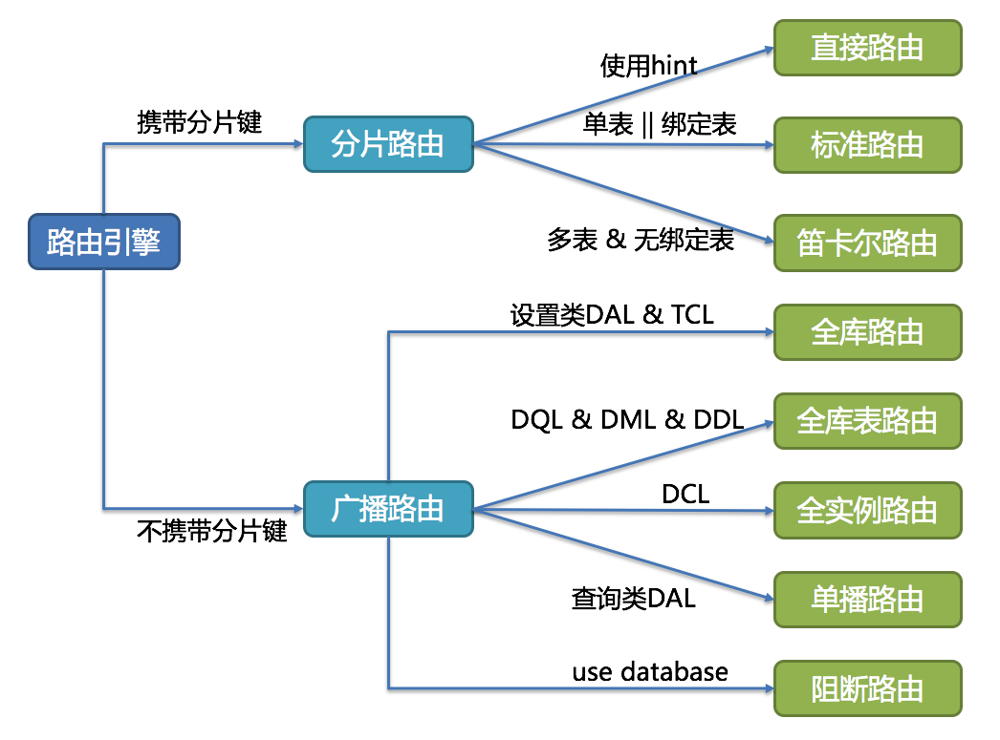
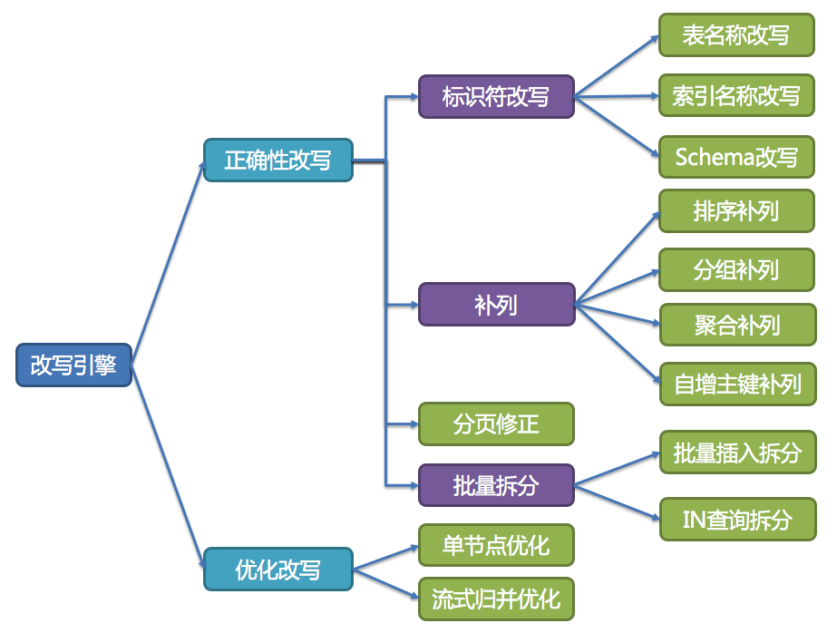
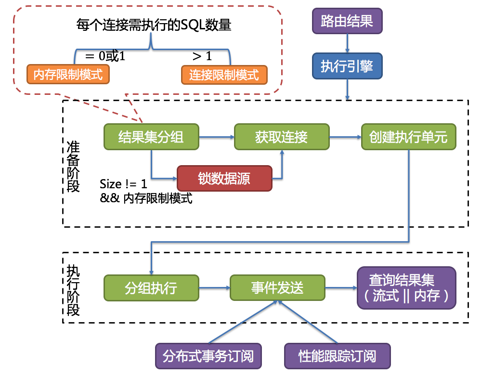

== 分库分表分片

=== 问题分析

. 主从复制
. 读写分离
. 分库分表
.. 水平拆分
+
某个字段按一定规律进行拆分，将一个表的数据分到多个表（库）中降低表的数据量，优化查询数据量的方式，来提高性能。
+
特点:: ①.每个库（表）的结构都一样。②.每个库（表）的数据都不一样。③.每个库（表）的并集是整个数据库的全量数据 。
+
分库分表常见算法:: ①.Hash取模：通过表的一列字段进行hash取出code值来区分的。（不好迁移） ②.Range范围： 按年份、按时间。（不好查找，如果找个数据没有时间，需要全部找） ③.List预定义：事先设定100找。（判断需要建立多少个分库）
+
解决问题:: 单表中数据量增长出现的压力。
+
不解决问题:: 表与表之间的io争夺。
+
分库分表之后带来的问题:: ①.查询数据结果集合并。②.sql的改变。③.分布式事务。④.全局唯一性id。
+
.. 垂直拆分
+
将一个字段（属性）比较多的表拆分成多个小表，将不同字段放到不同的表中降低单（表）库大小的目的来提高性能。
+
通俗:: 大表拆小表，拆分是基于关系型数据库的列（字段）来进行
+
特点:: ①. 每个库（表）的结构都不一样。②.每个库（表）数据都（至少有一列）一样。③.每个库（表）的并集是整个数据库的全量数据。④.每个库（表）的数据量（count）不会变的。
+
解决问题:: 表与表之间的io竞争。
+
不解决问题:: 单表中数据量增长出现的压力。

// 

没想到，无意间想到的一个点子（把大表拆分成两个表，不常用字段单独存储）竟然符合了垂直拆分的套路。

垂直拆分竟然可以分成两层面来搞：大的角度，按照业务拆分成商品、用户等多个模块；小的方面，把一张大表拆分成多个小表。

=== Sharding Sphere

==== 分片的核心概念

逻辑表:: 水平拆分的数据库（表）的相同逻辑和数据结构表的总称。例：订单数据根据主键尾数拆分为10张表，分别是torder0到torder9，他们的逻辑表名为t_order。

真实表:: 在分片的数据库中真实存在的物理表。即上个示例中的torder0到torder9。

数据节点:: 数据分片的最小单元。由数据源名称和数据表组成，例：ds0.torder_0。

绑定表:: 指分片规则一致的主表和子表。例如：torder表和torderitem表，均按照orderid分片，则此两张表互为绑定表关系。绑定表之间的多表关联查询不会出现笛卡尔积关联，关联查询效率将大大提升。

广播表:: 指所有的分片数据源中都存在的表，表结构和表中的数据在每个数据库中均完全一致。适用于数据量不大且需要与海量数据的表进行关联查询的场景，例如：字典表。

逻辑索引:: 某些数据库（如：PostgreSQL）不允许同一个库存在名称相同索引，某些数据库（如：MySQL）则允许只要同一个表中不存在名称相同的索引即可。 逻辑索引用于同一个库不允许出现相同索引名称的分表场景，需要将同库不同表的索引名称改写为索引名 + 表名，改写之前的索引名称成为逻辑索引。

==== 分片

分片键:: 用于分片的数据库字段，是将数据库(表)水平拆分的关键字段。例：将订单表中的订单主键的尾数取模分片，则订单主键为分片字段。 SQL中如果无分片字段，将执行全路由，性能较差。 除了对单分片字段的支持，ShardingSphere也支持根据多个字段进行分片。

分片算法:: 通过分片算法将数据分片，支持通过=、BETWEEN和IN分片。分片算法需要应用方开发者自行实现，可实现的灵活度非常高。
+
. 精确分片算法 -- 对应PreciseShardingAlgorithm，用于处理使用单一键作为分片键的=与IN进行分片的场景。需要配合StandardShardingStrategy使用。
. 范围分片算法 -- 对应RangeShardingAlgorithm，用于处理使用单一键作为分片键的BETWEEN AND进行分片的场景。需要配合StandardShardingStrategy使用。
. 复合分片算法 -- 对应ComplexKeysShardingAlgorithm，用于处理使用多键作为分片键进行分片的场景，包含多个分片键的逻辑较复杂，需要应用开发者自行处理其中的复杂度。需要配合ComplexShardingStrategy使用。
. Hint分片算法 -- 对应HintShardingAlgorithm，用于处理使用Hint行分片的场景。需要配合HintShardingStrategy使用。

分片策略:: 包含分片键和分片算法，由于分片算法的独立性，将其独立抽离。真正可用于分片操作的是分片键 + 分片算法，也就是分片策略。目前提供5种分片策略。
+
. 标准分片策略 -- 对应StandardShardingStrategy。提供对SQL语句中的=, IN和BETWEEN AND的分片操作支持。StandardShardingStrategy只支持单分片键，提供PreciseShardingAlgorithm和RangeShardingAlgorithm两个分片算法。PreciseShardingAlgorithm是必选的，用于处理=和IN的分片。RangeShardingAlgorithm是可选的，用于处理BETWEEN AND分片，如果不配置RangeShardingAlgorithm，SQL中的BETWEEN AND将按照全库路由处理。
. 复合分片策略 -- 对应ComplexShardingStrategy。复合分片策略。提供对SQL语句中的=, IN和BETWEEN AND的分片操作支持。ComplexShardingStrategy支持多分片键，由于多分片键之间的关系复杂，因此并未进行过多的封装，而是直接将分片键值组合以及分片操作符透传至分片算法，完全由应用开发者实现，提供最大的灵活度。
. 行表达式分片策略 -- 对应InlineShardingStrategy。使用Groovy的表达式，提供对SQL语句中的=和IN的分片操作支持，只支持单分片键。对于简单的分片算法，可以通过简单的配置使用，从而避免繁琐的Java代码开发，如: tuser$->{uid % 8} 表示tuser表根据uid模8，而分成8张表，表名称为tuser0到tuser_7。
. Hint分片策略 -- 对应HintShardingStrategy。通过Hint而非SQL解析的方式分片的策略。
. 不分片策略 -- 对应NoneShardingStrategy。不分片的策略。

//

=== 参考资料

. https://mp.weixin.qq.com/s/frdj6vFz24XEimPPQAgnVA[『互联网架构』软件架构-mysql终级解决方案分库分表（65）]
. https://mp.weixin.qq.com/s/Ktf__hB6kzZrhar4UG6Nog[『互联网架构』软件架构-Sharding-Sphere分库分表（66）]
. https://mp.weixin.qq.com/s/hInARjmbetXDEl0zd_AIEg[『互联网架构』软件架构-Sharding-Sphere特性详解（67）]

